Día 23. Le dije a una IA que me construyera Windows 95.

## El Prompt

Este fue pura nostalgia:

> "Build a Windows 95-inspired desktop environment that runs in the browser. Include a taskbar, start menu, draggable and resizable windows, and classic apps like Notepad, Calculator, Paint, Minesweeper, Terminal, Internet Explorer, and My Computer. Add a boot sequence, pixel art SVG icons, sound effects, wallpaper selection, a CRT effect, and a BSOD easter egg."


Pruébalo tú mismo [aquí](https://vibe30-day23-retroos.vercel.app)


## Cómo Se Construyó

[Watchfire](https://watchfire.io) dividió esto en 10 tareas. El alcance aquí era una locura. Esto no es una aplicación simple, es toda una interfaz de sistema operativo con un gestor de ventanas, una barra de tareas, un menú Inicio y siete aplicaciones separadas corriendo dentro. Cada una necesitaba su propio comportamiento, su propio aspecto de ventana, sus propias interacciones.

La lista de tareas cubrió primero el shell del escritorio (barra de tareas, menú Inicio, gestión de ventanas), después cada aplicación una por una, y finalmente los toques finales como la secuencia de arranque, el BSOD, el efecto de líneas de escaneo CRT y los efectos de sonido.



## Lo Que Obtuve

Esta cosa arranca.

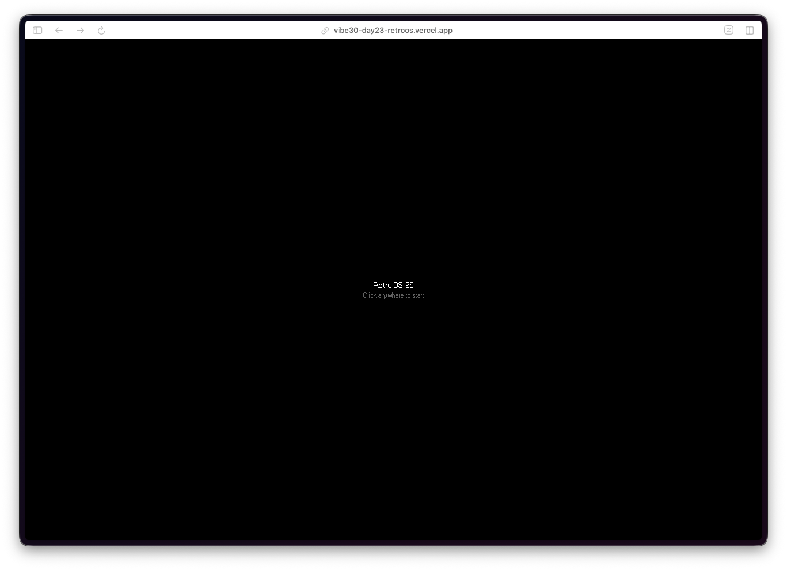

Cargas la página y aparece una pantalla negra que dice "RetroOS 95 - Click anywhere to start." Haces clic y aparece una secuencia POST en modo texto desplazándose, igual que la cosa real. Después una barra de progreso con "Starting RetroOS..." antes de que cargue el escritorio.

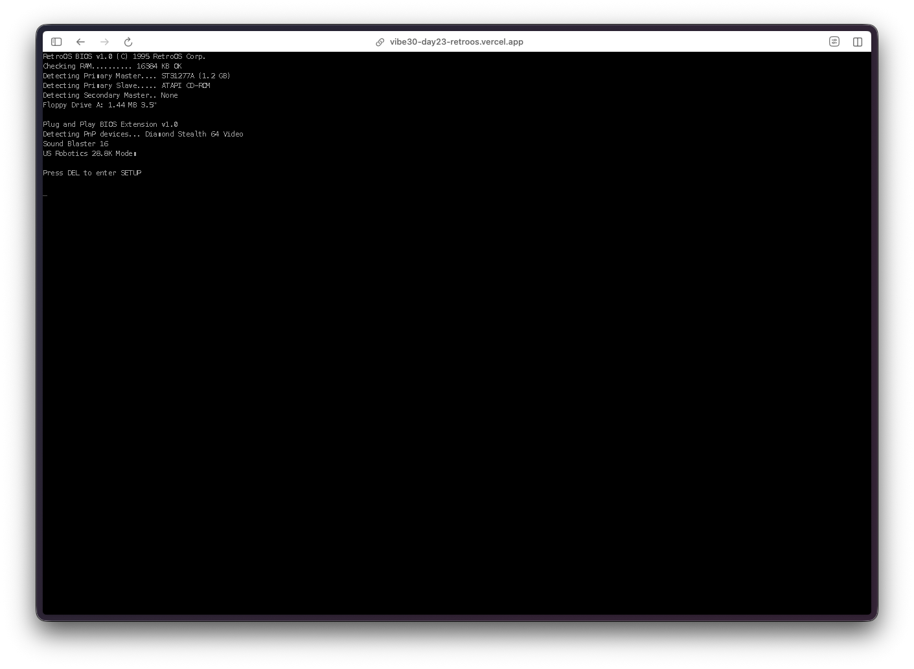

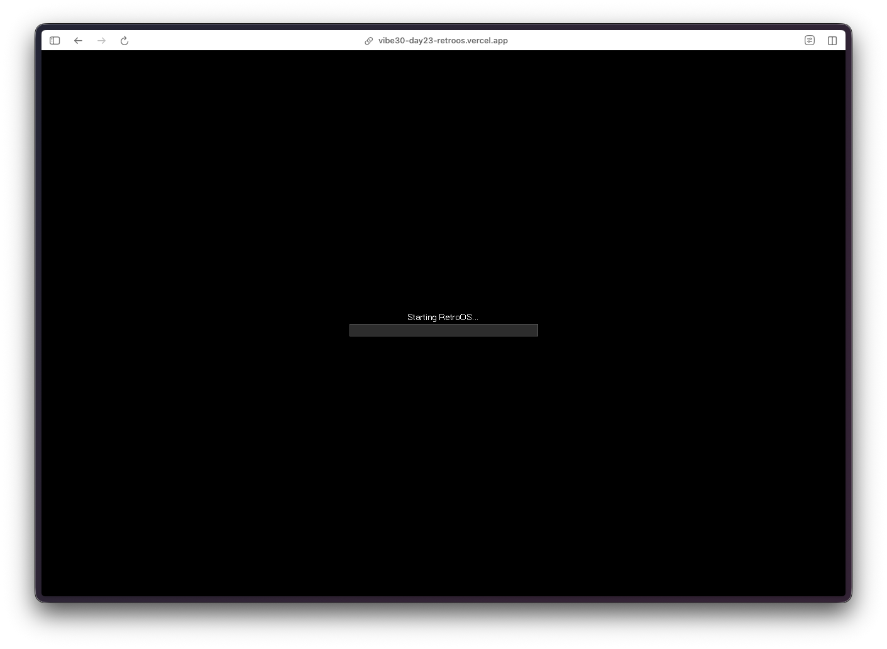

Luego aparece el escritorio y se ve bien. Ese tono específico de verde azulado. La barra de tareas gris y robusta en la parte inferior. El botón Inicio en la esquina. Iconos del escritorio alineados en el lado izquierdo con iconos SVG en pixel art que realmente parecen pertenecer a 1995.

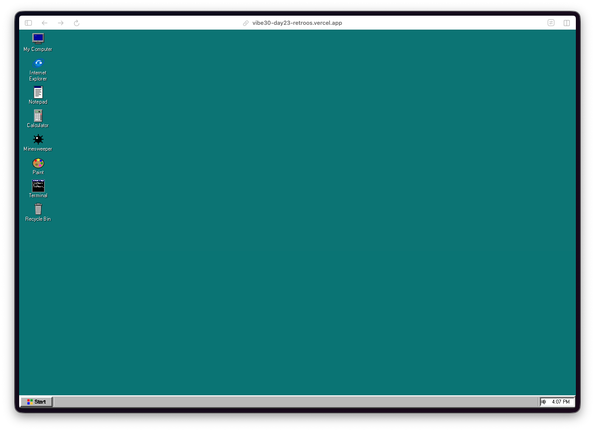

**El menú Inicio funciona.** Haces clic en Inicio y aparece el clásico menú en cascada con Programas, Documentos, Configuración, Buscar, Ayuda, Ejecutar y Apagar. Las aplicaciones están listadas ahí mismo. Incluso tiene ese borde biselado 3D por el que Win95 era conocido.

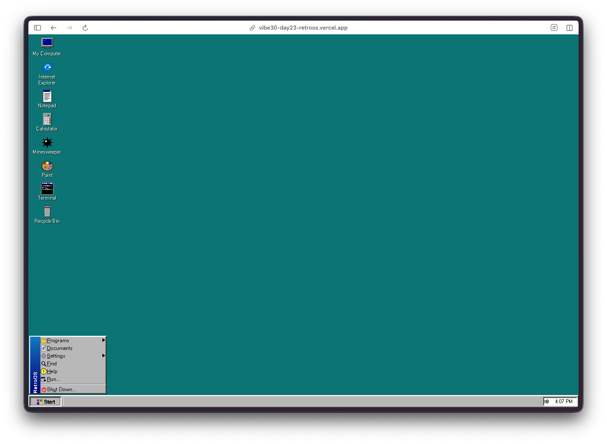

**El Terminal es sorprendentemente profundo.** No es solo un adorno visual. Puedes ejecutar `dir` y obtener un listado de archivos falso con AUTOEXEC.BAT y CONFIG.SYS. El formato de salida coincide con DOS, hasta el formato de fecha y el conteo de bytes. Incluso responde a `ver` con una cadena de versión.

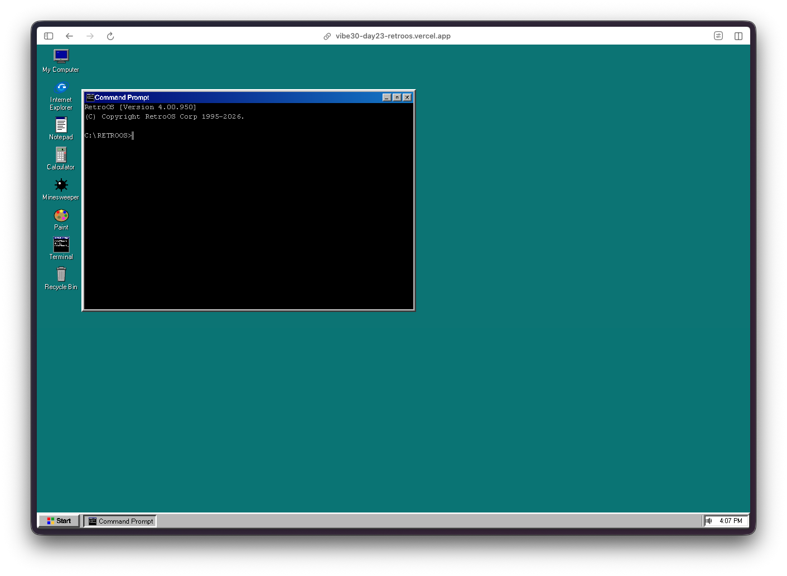

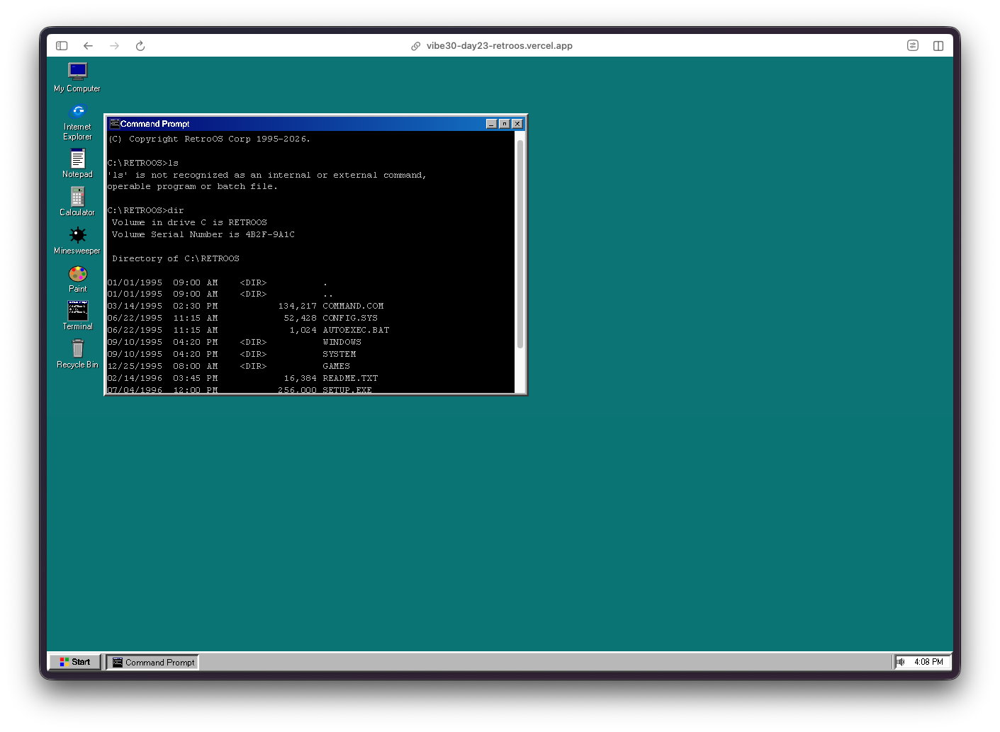

**La Calculadora funciona.** Disposición de botones como debe ser, la pantalla hundida, el marco biselado. Hace matemáticas de verdad. Se ve exactamente como la que solías abrir cuando estabas aburrido en clase de informática.

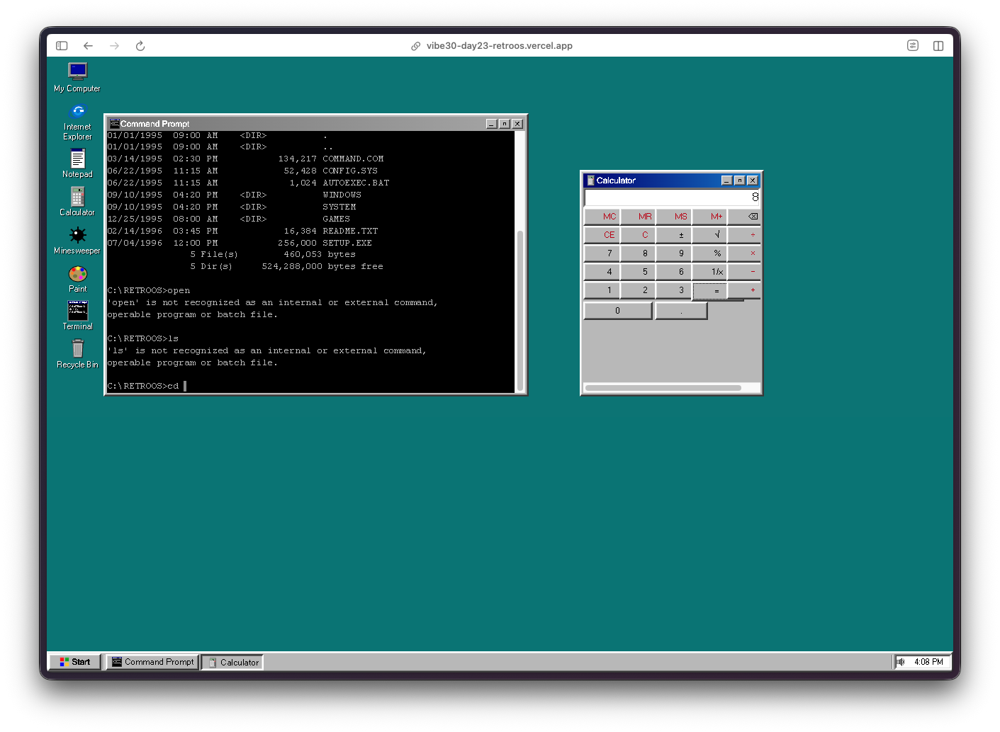

**Paint es funcional.** Tienes un lienzo, una paleta de colores en la parte inferior, y realmente puedes dibujar. La selección de herramientas está ahí. Dibujé una cara porque eso es lo que todos hacían en MS Paint en 1997.

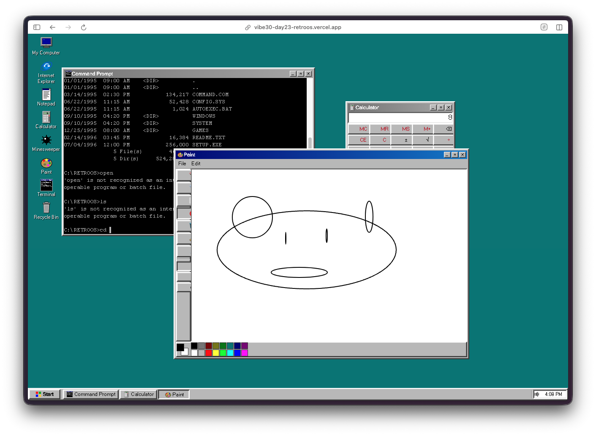

**Internet Explorer tiene una página de inicio falsa.** Carga una página retro estilo "Bienvenido a mi Página Web" con texto de colores, contador de visitas y un enlace al libro de visitas. La atención al detalle en esta me atrapó.

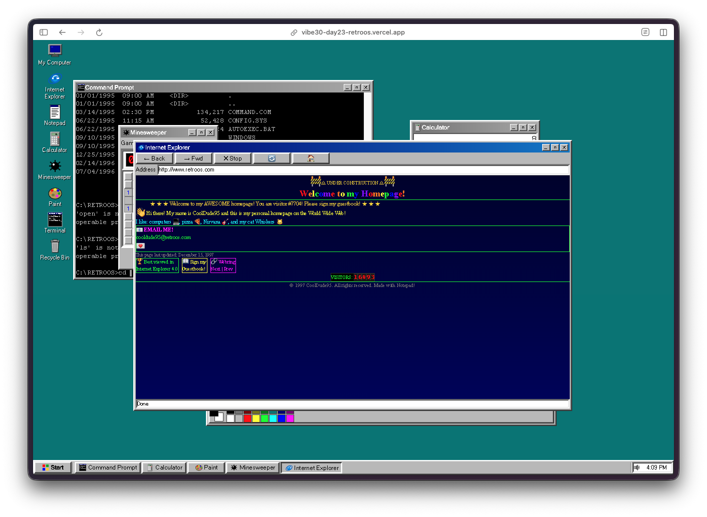

**Mi PC muestra unidades.** Disquete A:, disco duro C: y un CD-ROM D:. Es un explorador de archivos para un sistema de archivos que no existe, pero se ve exactamente bien.

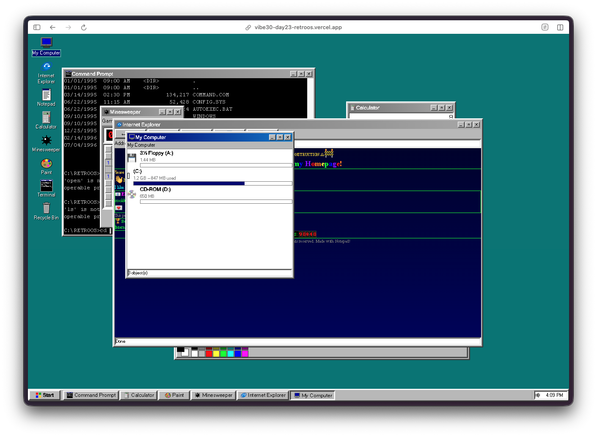

**El Buscaminas es jugable.** La cuadrícula clásica con el contador y la cara sonriente arriba. Números, banderas, minas. Es el auténtico.

**Todas las ventanas son arrastrables y redimensionables.** Puedes apilarlas, moverlas, minimizarlas a la barra de tareas, y la barra de tareas muestra todas las ventanas abiertas tal como lo hacía el SO real. Todo el sistema de gestión de ventanas funciona.

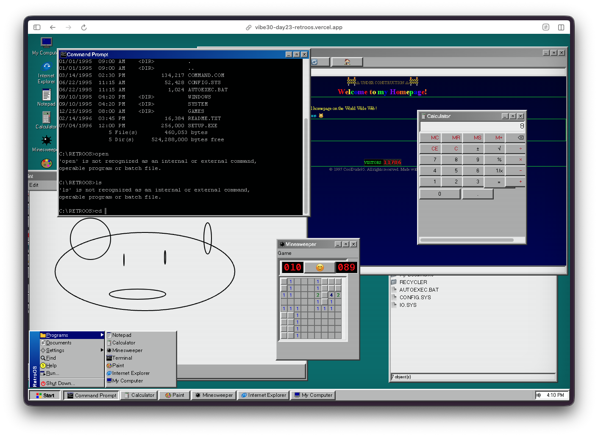

Y luego está el easter egg del BSOD. No voy a arruinar cómo activarlo, pero está ahí, y se ve auténtico.

## Los Reportes de Bugs

Honestamente, poco que reportar aquí. La gestión de ventanas funcionó a la primera. Las aplicaciones cargaron todas correctamente. Las cosas principales que noté:

- Algunas ventanas podían superponerse a la barra de tareas si las arrastrabas demasiado abajo
- El efecto CRT era un poco pesado en pantallas más pequeñas
- El primer clic en Buscaminas a veces podía caer en una mina (la versión real te protegía de eso)

Cosas menores. La experiencia principal fue sólida desde el principio.

## Pruébalo



**[Lanzar RetroOS](https://vibe30-day23-retroos.vercel.app)**

Haz clic en la pantalla negra para arrancar. Haz clic en Inicio para explorar. Abre todo. Prueba los comandos del Terminal. Dibuja algo en Paint. Juega Buscaminas. Encuentra el BSOD.

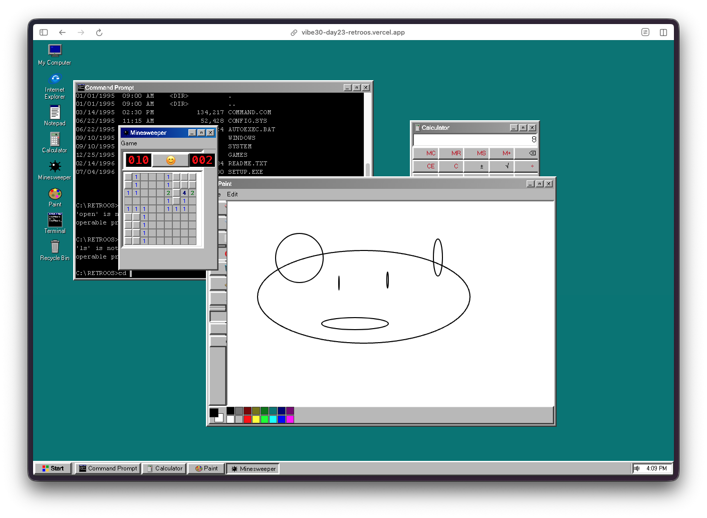

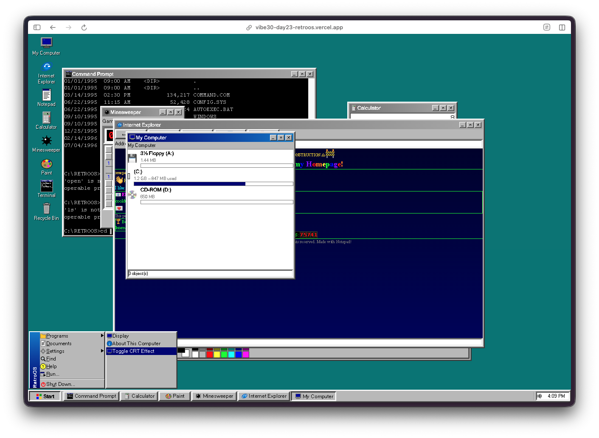

## Veredicto del Día 23

Este es uno de esos proyectos donde el factor nostalgia por sí solo ya vale la pena construirlo. Pero más allá de eso, el alcance técnico es impresionante. Un gestor de ventanas, siete aplicaciones separadas, una secuencia de arranque, efectos de sonido, atajos de teclado, un sistema de archivos falso, un internet falso. Todo desde una única sesión de prompts.

Lo que me impresiona es la atención al detalle. El color verde azulado del escritorio. El gris específico del aspecto de las ventanas. Los bordes biselados. La forma en que los botones de la barra de tareas se ven cuando una ventana está activa versus inactiva. Nadie le dijo que acertara esos detalles. Simplemente sabía cómo se veía Windows 95 y clavó la estética.

Si creciste haciendo clic en Inicio por primera vez en una torre beige a mediados de los 90, ve a probar este. Te llevará de vuelta.

---

*Este es el día 23 de [30 Days of Vibe Coding](/series/30-days-of-vibe-coding/). Sigue mientras lanzo 30 proyectos en 30 días usando programación asistida por IA.*
