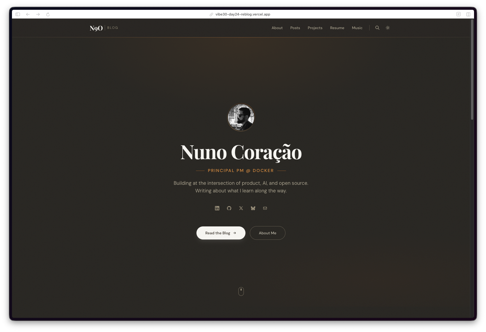
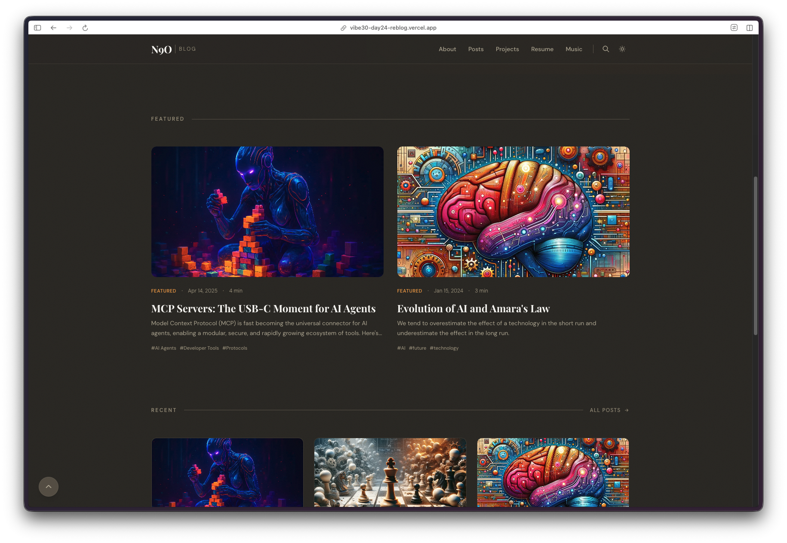
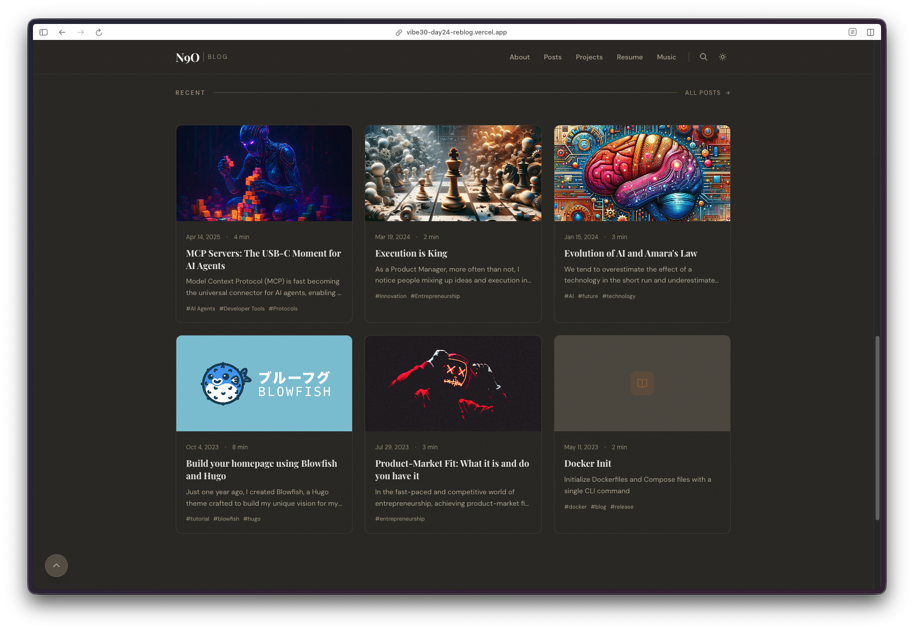
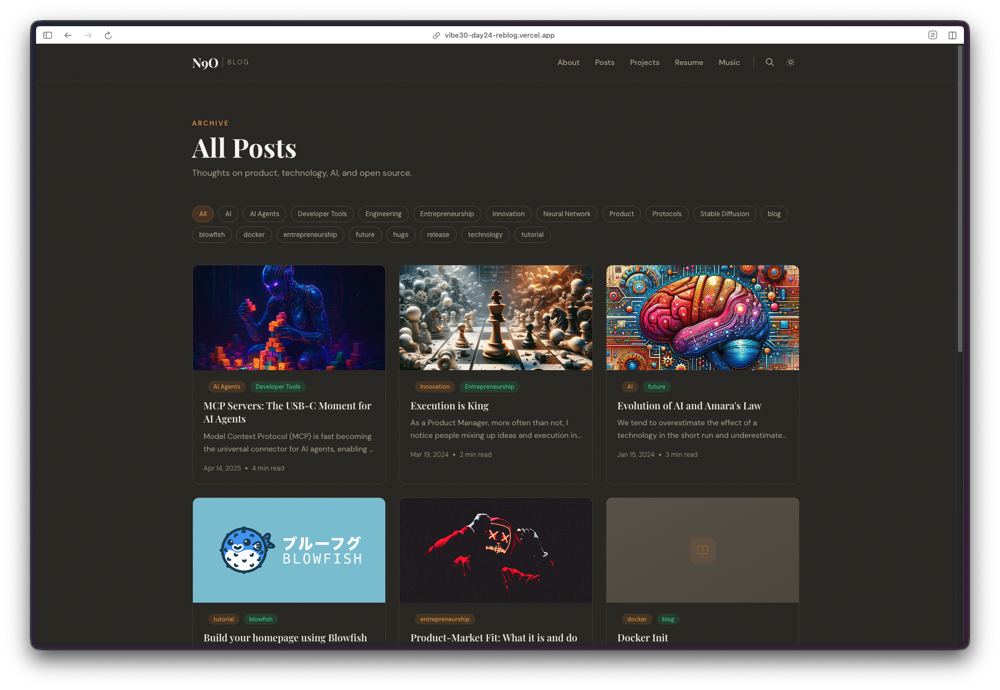
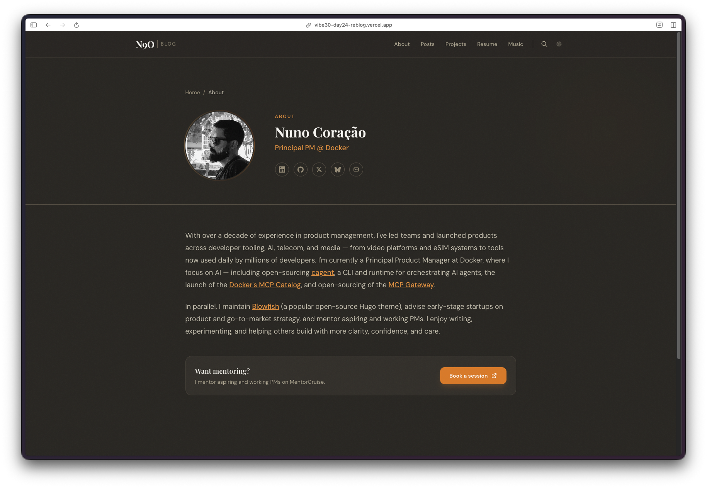
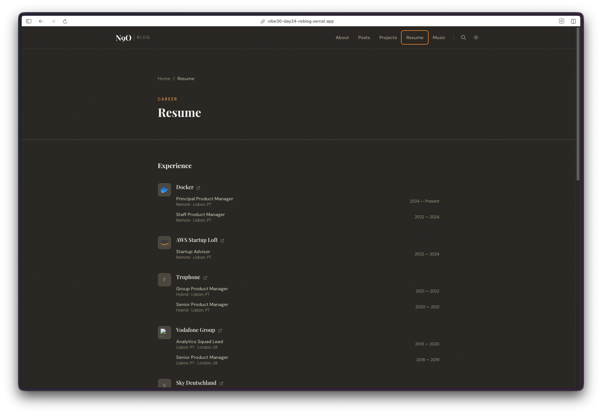
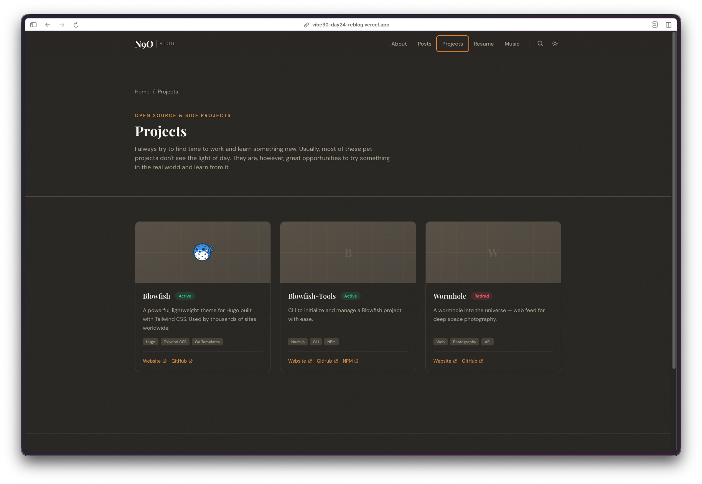
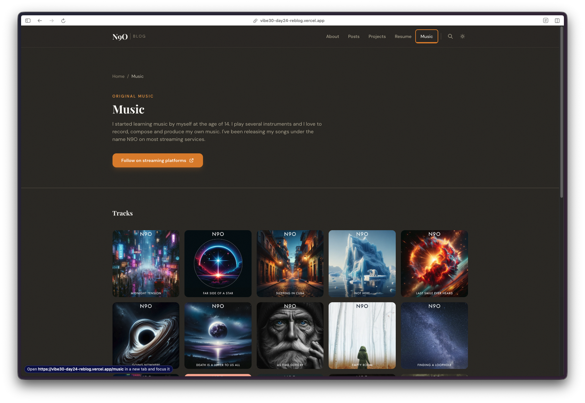
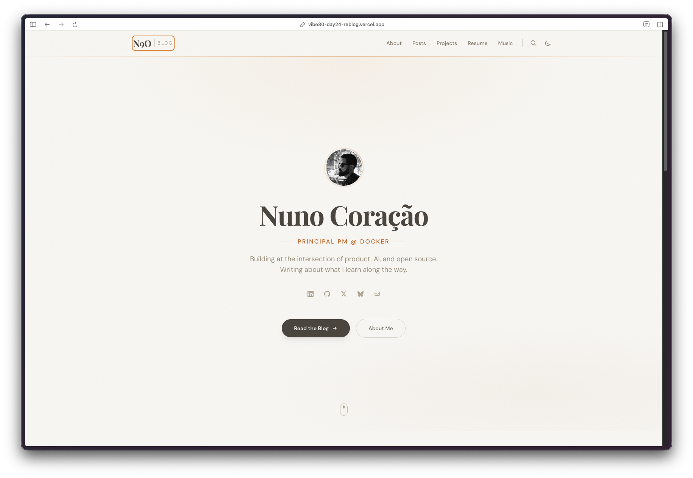
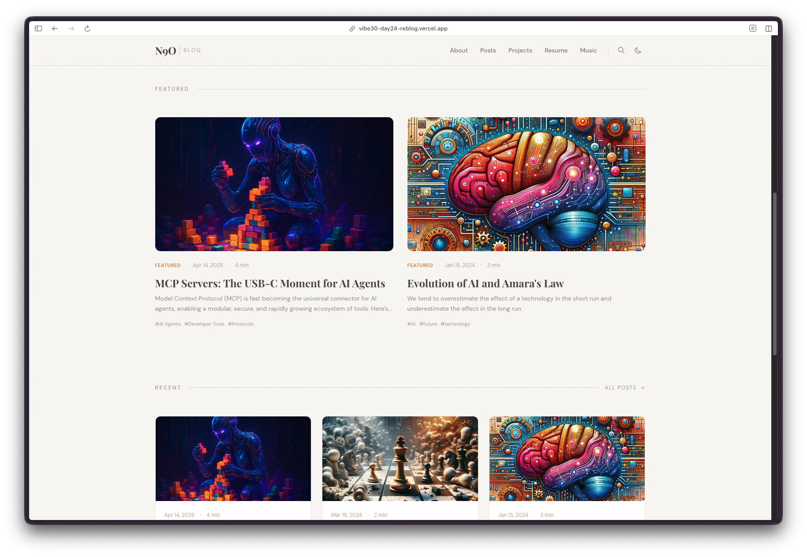

Day 24. I rebuilt my own blog.

This one's personal. My blog at [n9o.xyz](https://n9o.xyz) has been running on Hugo with my own theme, [Blowfish](https://blowfish.page), for years. I built Blowfish, I maintain it, thousands of people use it. But I've been wanting to move to something different for a while. A fresh visual identity, a different stack, something that feels more like me and less like a theme I made for everyone else.

So today's project was Reblog: a ground-up redesign of n9o.xyz, rebuilt from Hugo to Astro 5 with Tailwind CSS.

## The Prompt

This wasn't a single prompt. This was 18 [Watchfire](https://watchfire.io) tasks over the course of the day. The initial direction was something like:

> "Build a personal blog with Astro 5, Tailwind CSS, and MDX. Dark mode, featured posts, tag filtering, fuzzy search, a resume page, a music page, and a projects page. Custom typography with Sora, Crimson Pro, and JetBrains Mono."

From there it was an iterative process. Layout adjustments, color tweaks, adding structured data, fixing print styles, wiring up series support for multi-part content. The kind of work that normally takes weeks of back and forth between design and code.

## What I Got

A complete blog platform with six distinct sections.

**The homepage** has a hero section with my photo, title, bio, and social links. Below that, a featured posts section with large cards, then a recent posts grid. Clean, centered, and warm. The dark mode uses a muted olive-brown palette that I actually really like. It's not the typical dark gray or pure black.

**The posts page** has tag filtering along the top. Click a tag, the list filters instantly. No page reload, no server round trip. Just Astro doing its thing.

**Fuzzy search** is powered by Fuse.js. It loads client-side and searches across titles, descriptions, and tags. This is one of the few interactive islands in an otherwise zero-JS site. Astro's island architecture means the search component hydrates on its own without dragging in a framework for the entire page.

**The about page** pulls in my bio, links, and a mentoring callout. The resume page lists my career history with company logos and role progression. Both are clean and readable.

**The projects page** showcases open source work with status badges, tech tags, and links to repos and websites.

**The music page** is a grid of album art for tracks I've released under the name N9O. Each one links out to streaming platforms. This is a page I never had on the Hugo version and always wanted.



## Light Mode

The whole thing also works in light mode with system preference detection. Same layout, different palette.

The light version uses a warm cream background with the same typography. It automatically switches based on your OS settings, or you can toggle it manually.

## Under the Hood

The tech choices here were deliberate:

- **Astro 5** for static generation with zero JS by default
- **MDX** for blog posts so I can drop components into markdown when needed
- **Tailwind CSS** for styling without fighting a theme's CSS
- **Fuse.js** for client-side fuzzy search
- **Sharp** for automatic image optimization
- **Sora + Crimson Pro + JetBrains Mono** for typography that feels intentional
- **Structured data** and **sitemap** for SEO
- **RSS feed** for the three people who still use RSS (I'm one of them)
- **Print styles** because sometimes I print articles and they should look decent

## The 18 Tasks

Watchfire broke this into 18 tasks, which is the most granular breakdown I've seen from it so far. The initial batch covered the core: project scaffolding, layout components, homepage, posts page, about page, dark mode. Then I kept adding requests. "Add a music page." "Add series support." "The featured cards need more contrast." "Add print styles." "Add structured data."

Each iteration came back fast and mostly right. The visual design went through a few rounds before I landed on the warm palette. The first version was too sterile. The second was too dark. The third version hit the right balance between cozy and professional.

## Try It

{{/*< github repo="nunocoracao/Vibe30-day24-reblog" >*/}}

**[Live Demo](https://vibe30-day24-reblog.vercel.app)**

## Day 24 Verdict

This is the most personally meaningful project of the challenge so far. Not because it's the most technically impressive, but because it's something I've been putting off for months. Redesigning your own site is one of those tasks that never feels urgent enough to start. There's always something more important. And then one day you look at it and realize it doesn't represent you anymore.

Building a full blog platform with six pages, dark mode, search, tag filtering, series support, structured data, and print styles in a single day is not something I could have done on my own. Not even close. The Hugo/Blowfish version took me weeks of evenings and weekends, and that was with a framework I already knew inside out.

Will this actually replace n9o.xyz? Maybe. I need to migrate the content and live with it for a bit. But the fact that I have a working alternative ready to go, built in a day, is kind of wild.

---

*This is day 24 of [30 Days of Vibe Coding](/series/30-days-of-vibe-coding/). Follow along as I ship 30 projects in 30 days using AI-assisted coding.*
