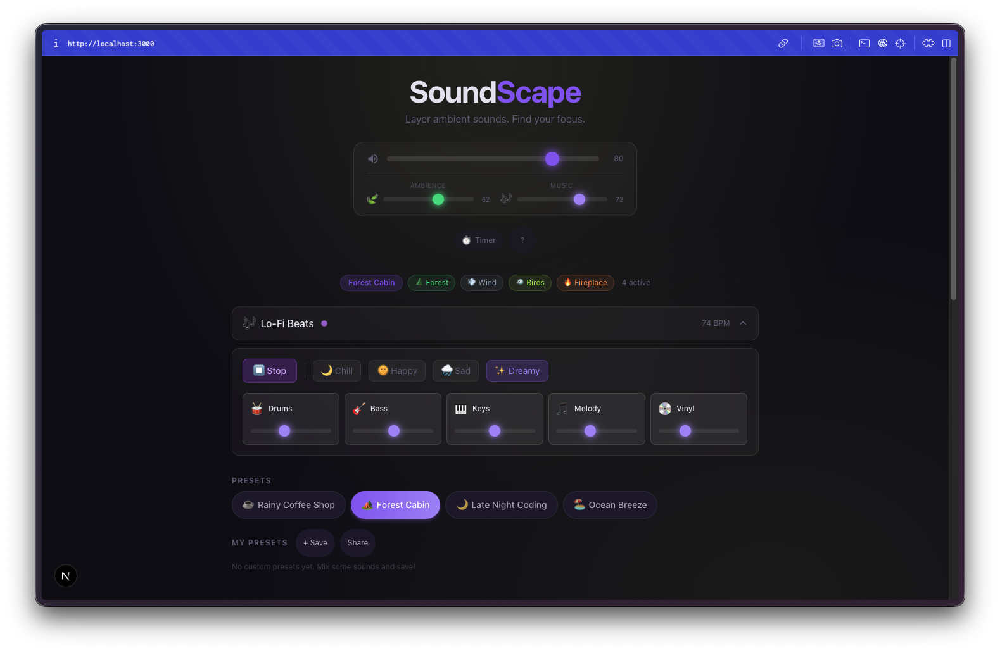
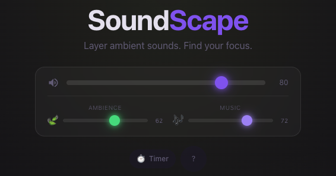
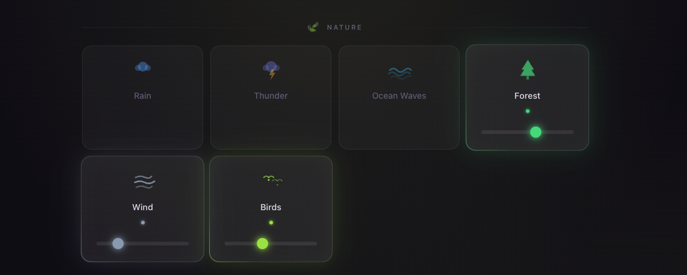
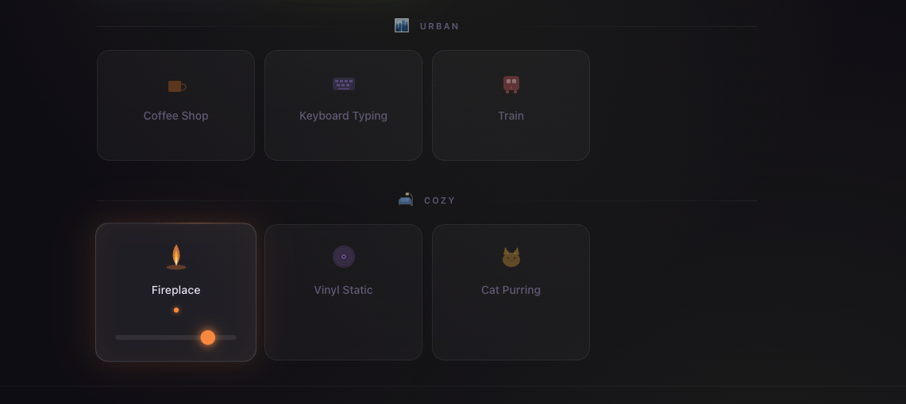
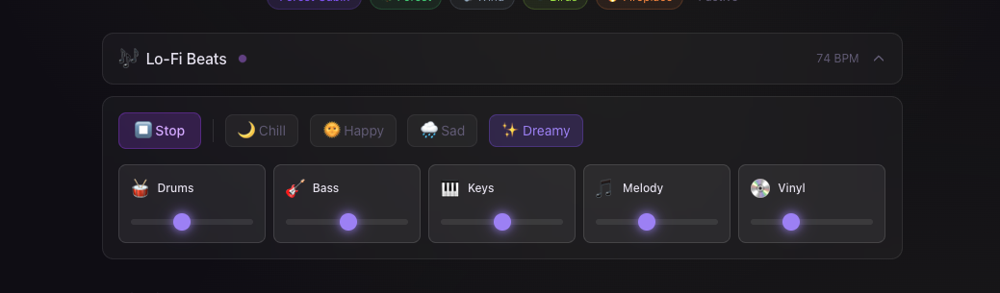

Day 25. I built myself the exact app I would actually use while building all the other days.

## The Prompt

The idea was simple: an ambient sound mixer where you layer sounds together to create a background atmosphere for working, relaxing, or sleeping. Think of those "coffee shop ambience" YouTube videos, but interactive and customizable.

The interesting constraint was that I wanted all audio to be procedurally generated using the Web Audio API. No sample files, no audio assets to load. Everything synthesized in the browser.

## How It Was Built

[Watchfire](https://watchfire.io) broke this down into 10 tasks. The initial plan actually used Howler.js with pre-recorded sound files, but I pivoted early to procedural generation with the Web Audio API. That meant every sound you hear, from rain to a crackling fireplace, is being generated mathematically in real time. No MP3s, no downloads, no loading screens.



## What I Got

This turned out way more polished than I expected.

**12 sounds across 3 categories.** Nature, Urban, and Cozy. Each one has its own card with a volume slider, and you can mix and match however you want. The Nature category has things like rain, forest, and ocean waves. Urban has coffee shop chatter and keyboard typing. Cozy has fireplace crackling.

**The master controls are clean.** Three sliders at the top for Ambience, Music, and overall volume, plus a timer button for sleep mode. The glassmorphism UI looks genuinely good against the dark background.

**Presets make it instantly useful.** There are four built-in presets: Rainy Coffee Shop, Forest Cabin, Late Night Coding, and Ocean Breeze. One click and you get a curated mix. Forest Cabin, for example, activates Forest, Wind, Birds, and Fireplace at different volume levels. You can also save your own custom presets to localStorage.

**Every sound is procedurally generated.** This is the part that surprised me most. Rain is white noise shaped with filters. Wind is low-frequency oscillators with slow modulation. Birds are short sine wave chirps with randomized timing. The fireplace is filtered noise with crackle bursts. None of it sounds perfect, but it all sounds recognizable and blends together well enough that your brain fills in the gaps.

**There's a lo-fi beat generator.** This wasn't in the original plan but showed up as a bonus. It has mood presets (Chill, Happy, Sad, Dreamy) and individual controls for Drums, Bass, Keys, Melody, and Vinyl crackle. It runs at 74 BPM and actually produces something you'd want in the background. The beats layer on top of the ambient sounds, so you can have rain plus lo-fi beats plus a fireplace going at once.

**The background shifts with your mix.** A dynamic gradient background changes based on which sounds are active. Nature-heavy mixes pull toward greens and blues, urban leans warmer. It's subtle but it makes the whole thing feel more alive.

**Share via URL.** You can share your exact mix with someone by copying the URL. It encodes which sounds are active and their volume levels, so anyone opening the link gets your exact setup.

**Keyboard shortcuts everywhere.** Space to pause everything, number keys 1-9 and 0 to toggle individual sounds, Escape to stop all. The sleep timer does a gentle fade-out over your chosen duration (15, 30, 60, or 90 minutes).

## The Bug Reports

The procedural audio approach meant most of the bugs were audio-related:

- Some sounds had clicks and pops when toggling on and off (needed proper gain ramping)
- The lo-fi beat generator timing drifted slightly over long sessions
- A few of the synthesized sounds were too harsh at full volume before the filters were tuned

Nothing major. The Web Audio API is powerful but unforgiving if you don't handle audio context lifecycle properly.

## Try It

{{/*< github repo="nunocoracao/Vibe30-day25-soundscape" >*/}}

**[Open SoundScape](https://vibe30-day25-soundscape.vercel.app)**

Best experienced with headphones. Try the "Late Night Coding" preset and turn on Lo-Fi Beats.

## Day 25 Verdict

There's something satisfying about mixing your own ambient background instead of hunting for the right YouTube video or Spotify playlist. And the fact that it's all procedurally generated means there are no loops, no repetition. The rain just keeps going, always slightly different.

The Web Audio API is underrated. I had no idea you could synthesize this many different sounds purely with oscillators, noise generators, and filters. It's not studio quality, but for background ambience it works surprisingly well. Zero audio files means the whole app loads instantly and works offline.

Five days left.

---

*This is day 25 of [30 Days of Vibe Coding](/series/30-days-of-vibe-coding/). Follow along as I ship 30 projects in 30 days using AI-assisted coding.*
