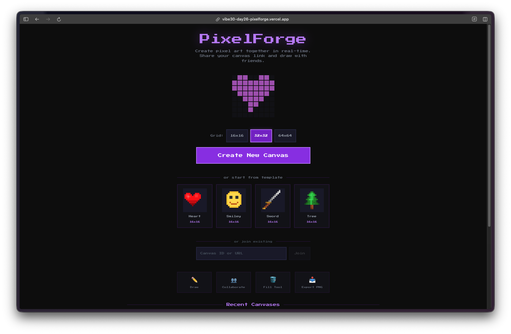
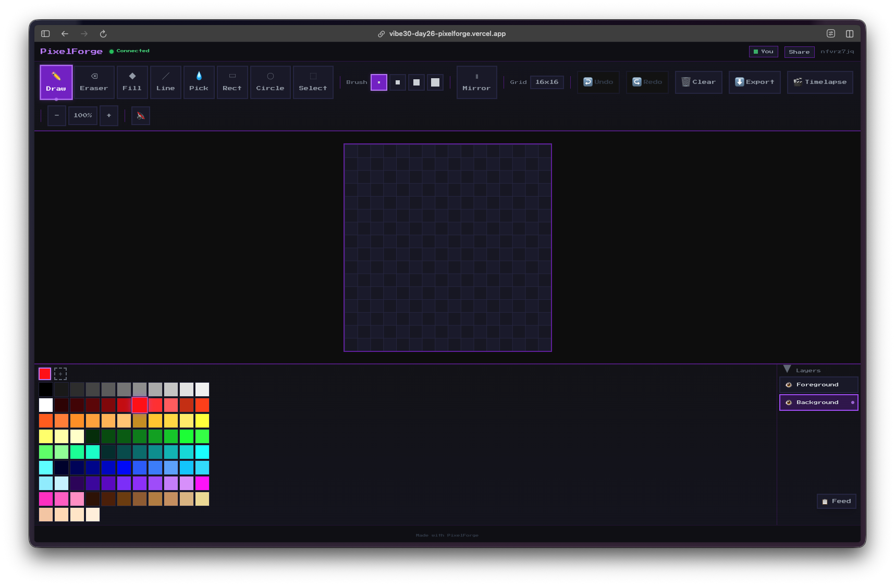
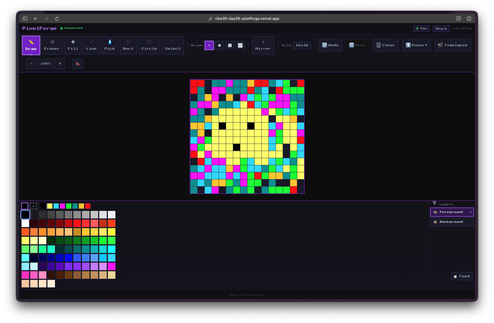
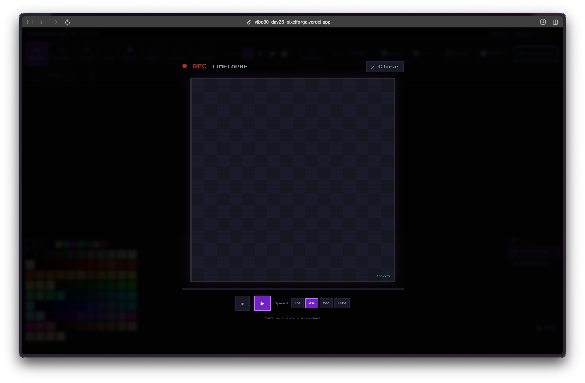
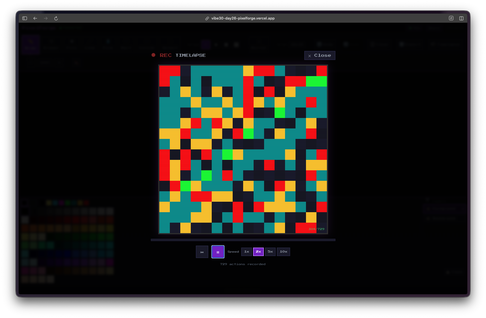
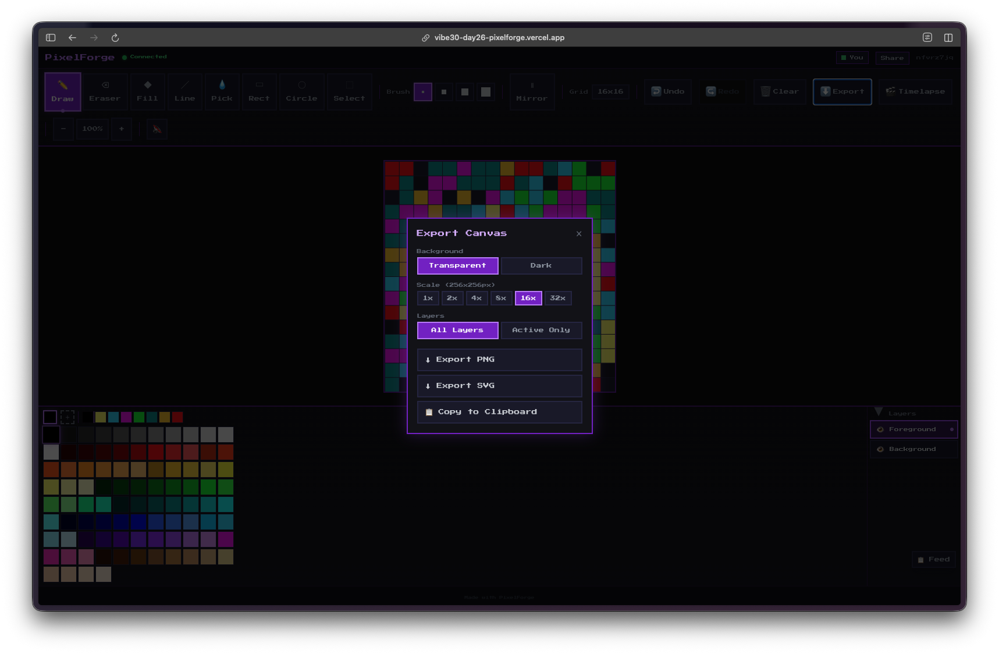
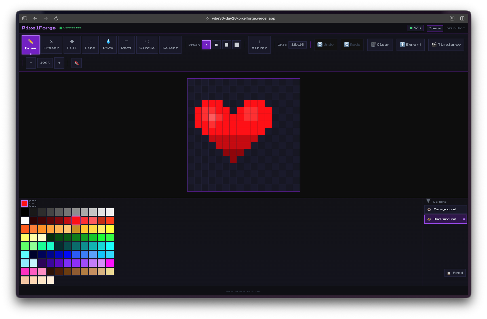
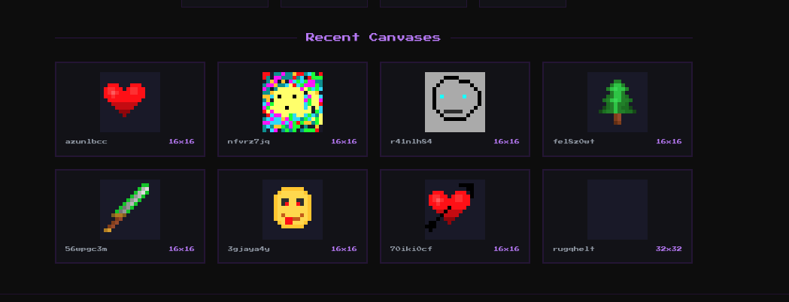

Day 26. I wanted to build something collaborative, something where people could actually create together in real time. So I went with a pixel art canvas.

## The Prompt

The starting point was simple:

> "Build a collaborative pixel art canvas where multiple users can draw together in real time."


Try it out yourself [here](https://vibe30-day26-pixelforge.vercel.app)


## How It Was Built

[Watchfire](https://watchfire.io) broke this down into 13 tasks, which is a lot for a single day project. But pixel art editors have a surprising number of moving parts once you start thinking about all the tools people expect.

The first few tasks covered the foundation: setting up the canvas with Firebase Realtime Database for sync, adding selectable grid sizes (16x16, 32x32, 64x64), and building a 32-color palette with a custom color picker. From there it branched into the actual drawing tools: pen, eraser, and flood fill.

Then it just kept going. Undo/redo support. A symmetry mode for creating mirrored designs. Shape tools for rectangles and lines. Adjustable brush sizes. Canvas templates so you don't have to start from scratch every time. A timelapse playback feature that replays how a canvas was drawn. An activity feed showing what other users are doing. A selection tool for moving and copying regions. A 2-layer system with foreground and background layers. And finally, export options for getting your art out as PNG in various sizes.

Thirteen tasks. That is a full-featured drawing application.



## What I Got

The landing page already set the tone. It shows starter templates (heart, sword, smiley, tree) and a gallery of recent canvases that other users have created. You can jump into any of them or create a new one from scratch.

The editor itself is surprisingly complete. Along the top you get the full toolbar: pen, eraser, fill, line, rect, circle, and selection tools. On the left there's the expanded color palette with the custom picker. On the right there's the layer panel with foreground and background layers, each with visibility toggles.

Drawing feels responsive. Each pixel click syncs through Firebase so anyone on the same canvas URL sees changes immediately. The grid lines help you stay precise, and the zoom level adjusts well across different grid sizes.

The timelapse feature is one of those things I didn't expect to work this well. It records every pixel placement and can replay the entire drawing process from start to finish. You get playback controls and speed options.

Watching a complex piece come together pixel by pixel is oddly satisfying. It also serves as a nice way to see how other people approach their drawings.

The export dialog gives you real options. You can set a transparent background, choose from multiple output sizes (1x, 2x, 4x, 8x), and export as PNG, SVG, or copy directly to clipboard. For a pixel art tool, having the upscaling built in is important since nobody wants a 16x16 PNG at actual size.

The templates are a nice touch. This heart template comes pre-loaded so you can start adding detail and shading right away instead of drawing the outline from scratch. The 2-layer system means you can keep the template on the background layer and paint on the foreground without worrying about messing up the base shape.

The recent canvases section on the home page acts like a community gallery. You can see what others have made, and each canvas shows its grid size. Hearts, faces, swords, trees... people naturally gravitate toward the same kinds of pixel art subjects.

## The Bug Reports

The main issues I ran into during testing:

- Flood fill on larger grids (64x64) could feel sluggish when syncing every changed pixel individually. Needed batched updates.
- The symmetry mode didn't always align correctly on even-numbered grid sizes at first.
- Touch drawing on mobile needed some work to prevent the page from scrolling while you were trying to draw.
- Layer switching wasn't always obvious visually, so it was easy to draw on the wrong layer without realizing it.

## The Numbers

- **13 Watchfire tasks** from initial canvas to export options
- **3 grid sizes** with real-time sync across all of them
- **32-color palette** plus custom color picker
- **8 drawing tools** including shapes and selection
- **2-layer system** with independent visibility
- **Firebase Realtime Database** handling all the collaboration

## Try It

{{/*< github repo="nunocoracao/Vibe30-day26-pixelforge" >*/}}

**[Try PixelForge](https://vibe30-day26-pixelforge.vercel.app)**

Create a canvas and share the link. Anyone with the URL can draw with you.

## Day 26 Verdict

This one surprised me with how much depth it ended up having. A pixel art canvas sounds simple, but once you add layers, symmetry, templates, timelapse, and real-time collaboration, you are looking at a legitimate creative tool.

The Firebase integration is the core of the whole thing. Every pixel change goes through the Realtime Database, which means multiple people can genuinely draw on the same canvas at the same time. No polling, no refresh button, just live updates. The fact that all 13 tasks came together into something this cohesive from a single prompt is still wild to me.

Is it going to replace Aseprite or Piskel? No. But for quick collaborative pixel art sessions, it does the job. And the timelapse playback alone makes it worth trying. There is something really fun about watching a blank grid turn into art one pixel at a time.

---

*This is day 26 of [30 Days of Vibe Coding](/series/30-days-of-vibe-coding/). Follow along as I ship 30 projects in 30 days using AI-assisted coding.*
