Day 27. I asked an AI to build me a terminal emulator. A real one. Not a web toy that pretends to be a terminal, but an actual native desktop app that runs your shell.

## The Prompt

> "Build a terminal emulator using Tauri 2 and Rust"

That was the core ask. Everything else came from iteration.

## How It Was Built

This was a big one. [Watchfire](https://watchfire.io) broke the work down into 19 tasks, and it needed every single one of them. Building a terminal emulator is not trivial. There's PTY management, shell integration, input handling, rendering performance, and a dozen other things I never would have thought about.

The task list went something like this:

1. Scaffold a Tauri 2 + Vite project with basic PTY support
2. Multiple tabs with open, close, and rename
3. Split panes, horizontal and vertical
4. Settings panel with themes, fonts, and shell config
5. UI polish, scrollback, and shell fixes
6. GitHub Actions for automated releases
7. AI command suggestions inline
8. Visual polish for transparency, blur, and window chrome
9. Clickable links and smart detection in terminal output
10. Shell profiles and quick actions
11. Dangerous command warnings with confirmation dialogs
12. Long-running command notifications
13. Fuzzy history search with a rich Ctrl+R overlay
14. Inline ghost suggestions from history files
15. Intelligent error detection with quick-fix actions
16. Natural language to command translation
17. Command explanation and AI output summarization
18. Block-based output grouping with collapsible sections
19. Smart features settings panel and integration testing

Then came the CI/CD fixes. Getting Tauri to build and sign across macOS, Linux, and Windows through GitHub Actions is its own adventure. Install scripts for all three platforms too.



## What I Got

This one floored me.

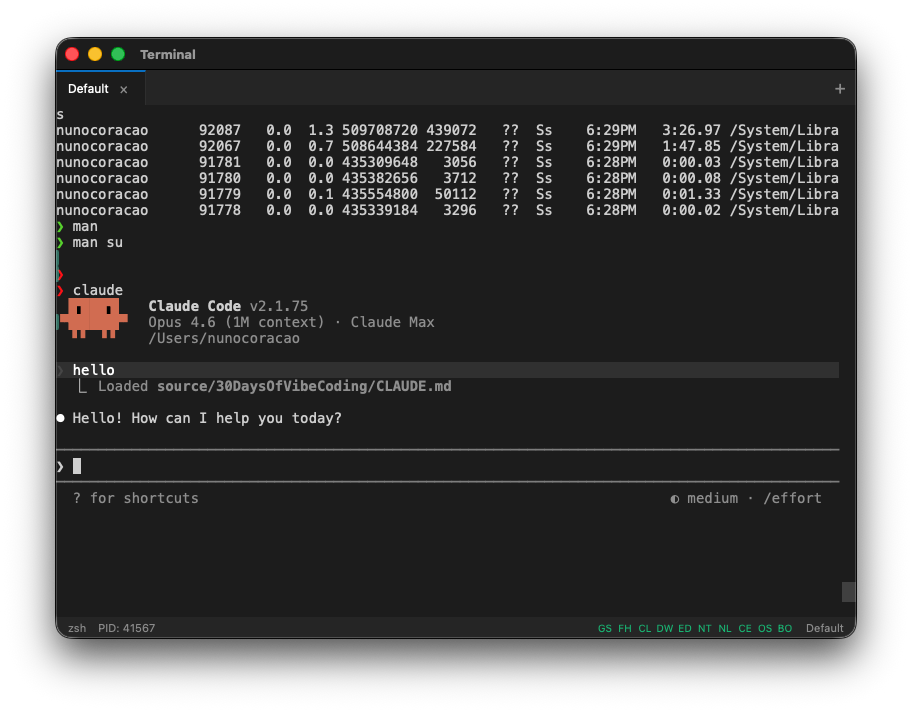

**It is a real terminal.** This is not a simulation. It uses Rust's portable-pty crate to spawn actual shell sessions. Bash, zsh, fish, whatever you have configured. Full PTY support means everything works: vim, htop, interactive prompts, all of it.

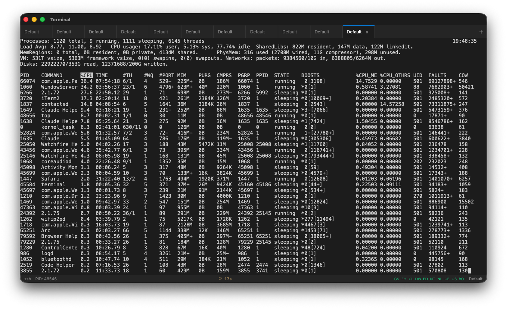

**xterm.js with WebGL acceleration.** The rendering is fast. Like, noticeably fast. Scrollback goes up to 10,000 lines and it doesn't choke. The WebGL renderer makes a real difference compared to the standard canvas approach.

**Tabs and split panes.** Cmd+T for a new tab, Cmd+D for a vertical split, Cmd+Shift+D for a horizontal split. You can rename tabs. The pane management works exactly like you'd expect from a modern terminal.

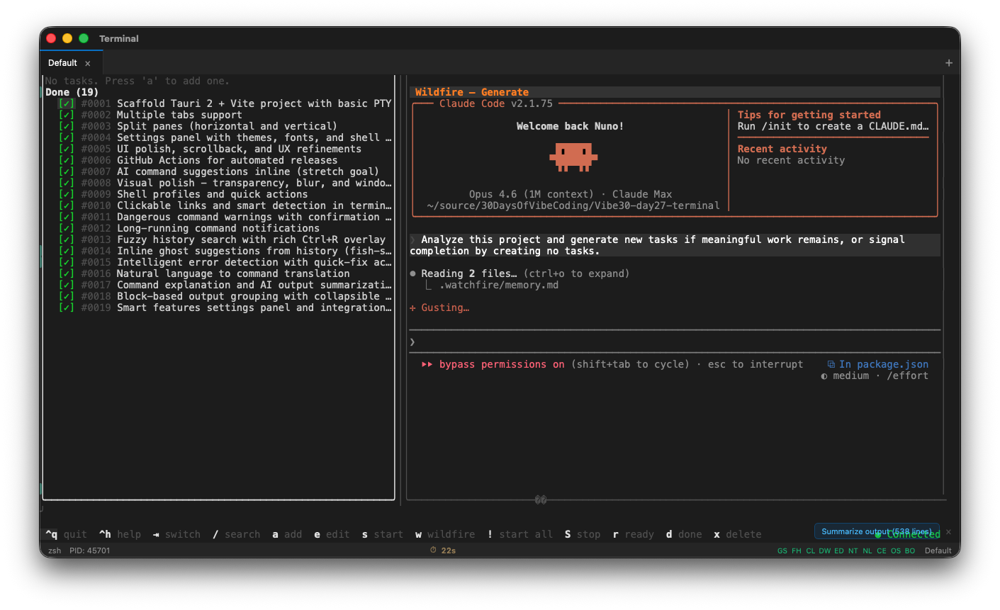

**It has a smart features tour.** When you first open the app, it walks you through the intelligent features with a guided tour.

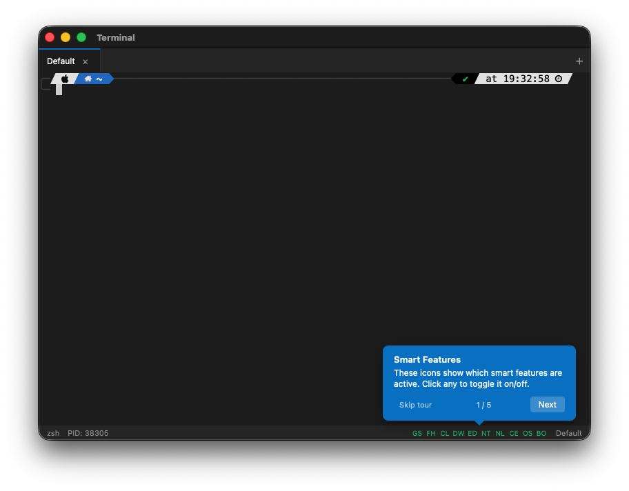

Those smart features include ghost suggestions from your command history, fuzzy history search with Ctrl+R, dangerous command warnings for things like `rm -rf` or `git push --force`, and natural language to command translation.

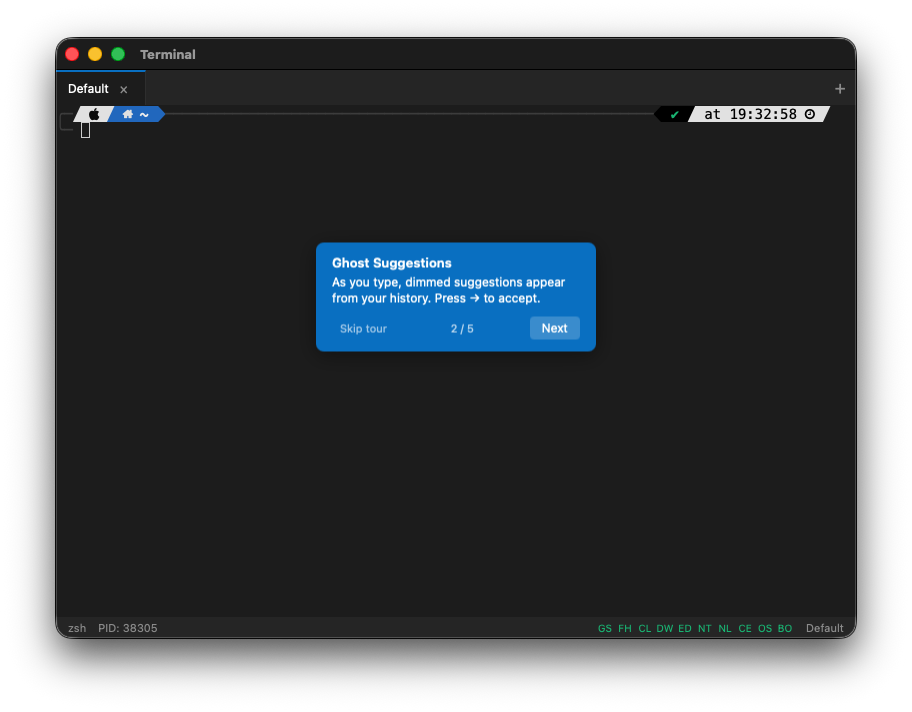

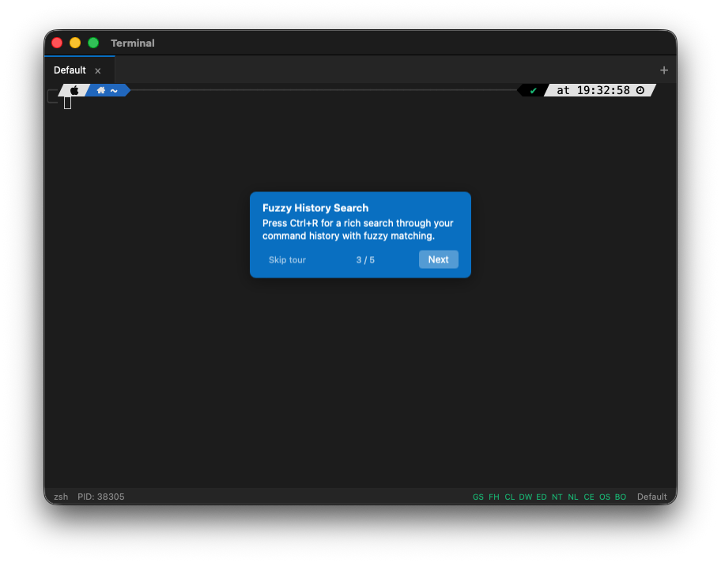

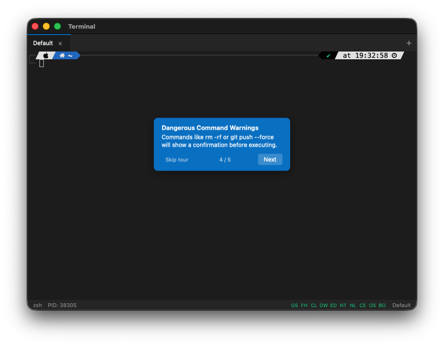

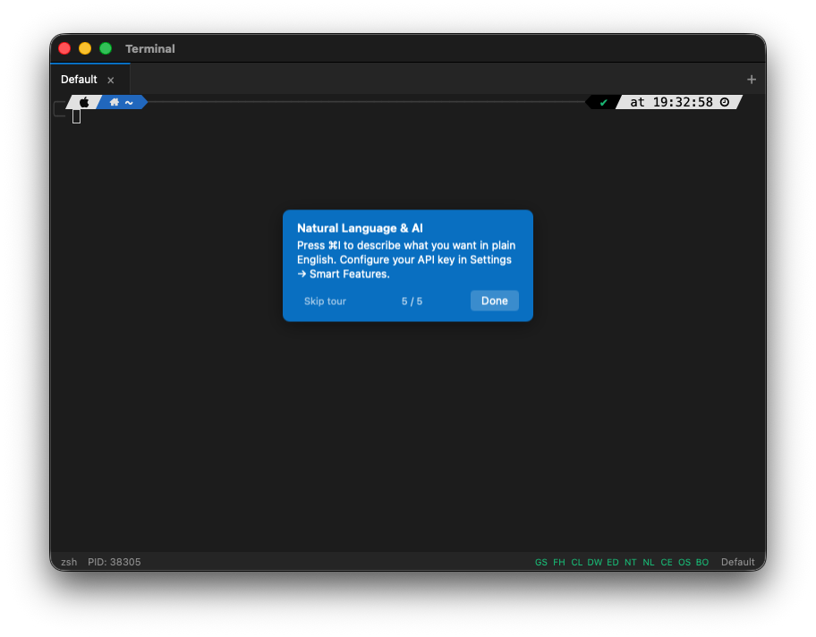

**A full settings panel.** Font family, font size, cursor style, color themes. It ships with Dracula, Solarized, Monokai, and more. You can configure background blur, transparency, and shell arguments.

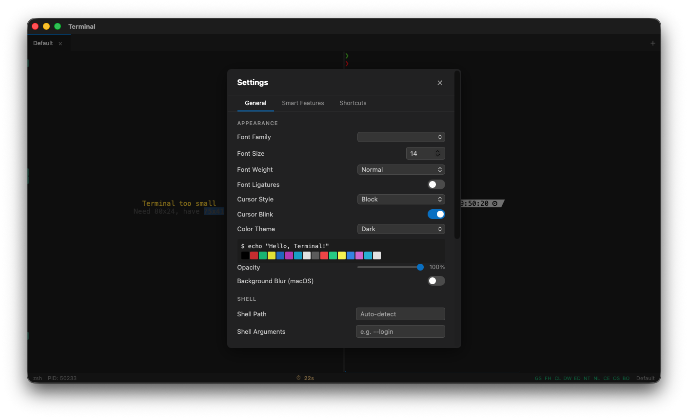

**Command search in scrollback.** Ctrl+F opens a search overlay that lets you search through your terminal history with fuzzy matching.

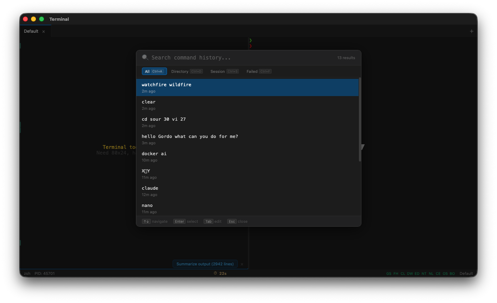

**Block-based output grouping.** Long command outputs get grouped into collapsible blocks. There's a "Summarize output" button for when a command spits out 2,000 lines and you just want the gist.

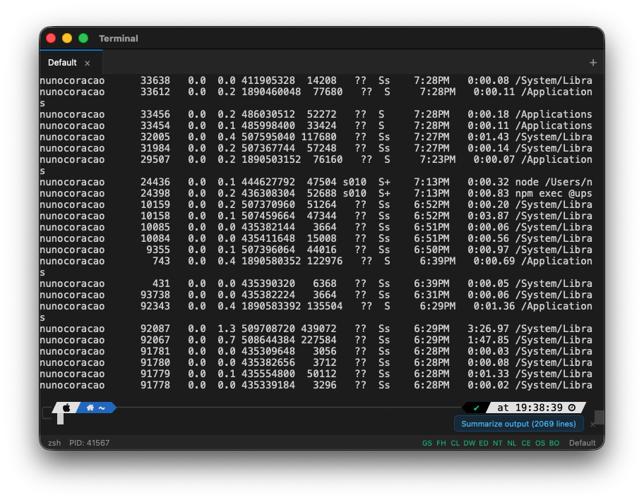

**It runs pico.** It runs vim. It runs everything a terminal should run, because it is a terminal.

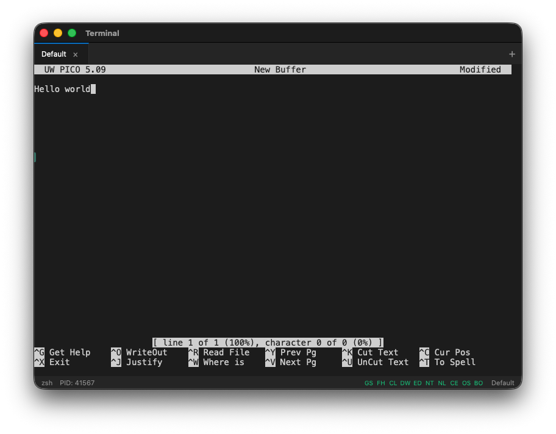

**It even runs Docker's AI assistant.** Full interactive TUI applications work without issues.

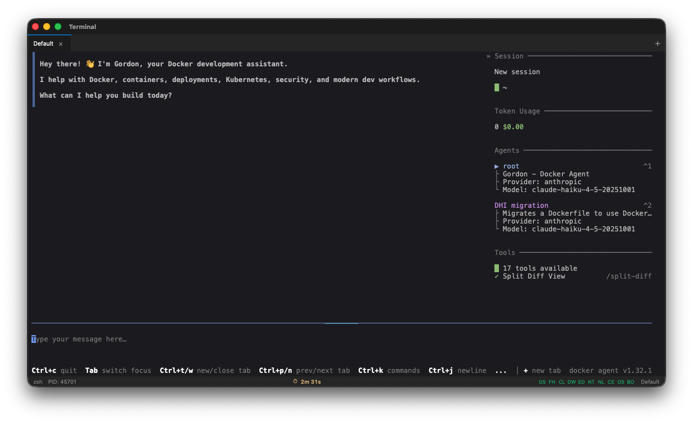

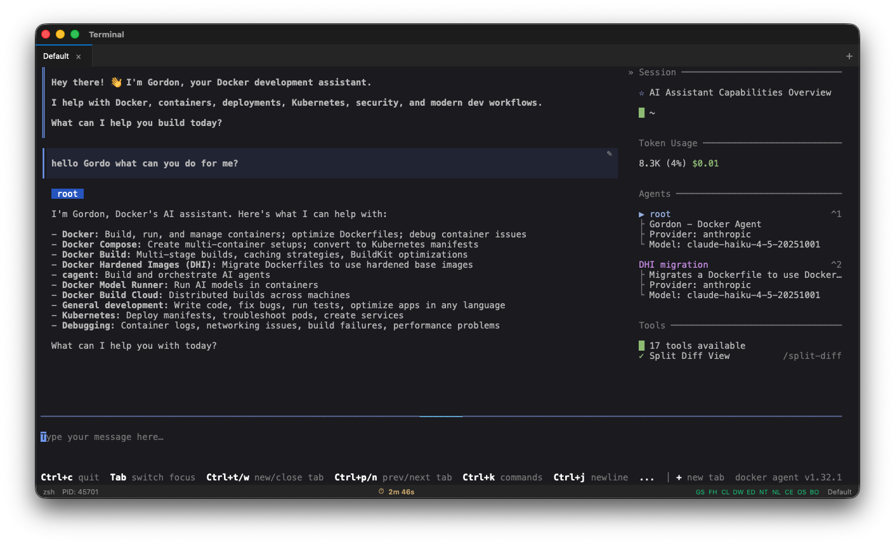

**It runs Claude Code inside it.** I used the terminal to run Claude Code to build more features for the terminal. That felt like a very specific kind of inception.


## Install It

This is a native app, not a website. No Vercel deployment here. You can grab the latest release from the GitHub releases page, or use the install scripts:

```bash
# macOS / Linux
curl -fsSL https://raw.githubusercontent.com/nunocoracao/Vibe30-day27-terminal/main/install.sh | bash
```

```powershell
# Windows (PowerShell)
irm https://raw.githubusercontent.com/nunocoracao/Vibe30-day27-terminal/main/install.ps1 | iex
```

Or build from source if you want:

```bash
git clone https://github.com/nunocoracao/Vibe30-day27-terminal.git
cd Vibe30-day27-terminal
npm install
npm run tauri dev
```

Requires Rust 1.77.2+ and Node.js 20+.

{{/*< github repo="nunocoracao/Vibe30-day27-terminal" >*/}}

## The Numbers

- **19 Watchfire tasks** from scaffold to smart features integration
- **Tauri 2 + Rust backend** with portable-pty for real shell sessions
- **xterm.js with WebGL** for fast rendering
- **6+ color themes** including Dracula, Solarized, and Monokai
- **CI/CD pipeline** with GitHub Actions building for macOS, Linux, and Windows
- **Install scripts** for all three platforms

## Day 27 Verdict

A terminal emulator touches so many layers. PTY management in Rust. IPC between the Rust backend and the JavaScript frontend through Tauri. WebGL rendering for performance. Cross-platform builds and code signing through CI/CD. Install scripts that detect your OS and architecture.

And then on top of all that, it added smart features. Ghost suggestions, fuzzy search, dangerous command warnings, AI integration. These aren't gimmicks. I actually found the dangerous command warnings useful when I accidentally typed something destructive during testing.

The fact that this works at all is impressive. The fact that it works well enough that I actually used it to run Claude Code to build more of its own features is something else entirely. I'm not going to replace iTerm with it tomorrow, but the gap between "vibe coded terminal" and "production terminal" is smaller than I expected.

Day 27 of 30. Three more to go.

---

*This is day 27 of [30 Days of Vibe Coding](/series/30-days-of-vibe-coding/). Follow along as I ship 30 projects in 30 days using AI-assisted coding.*
