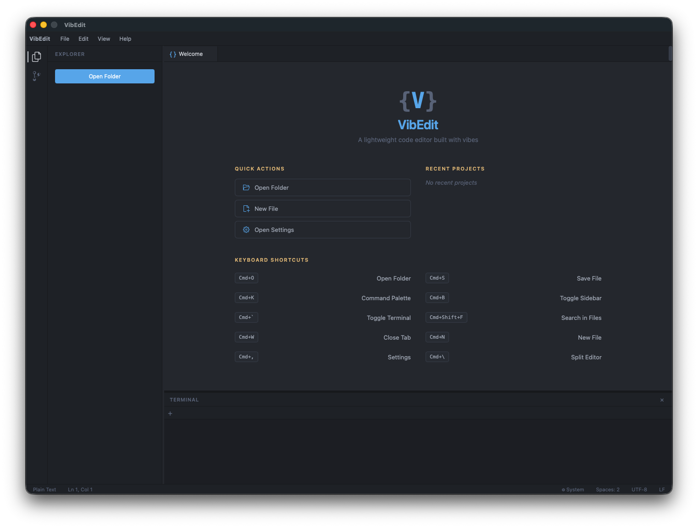
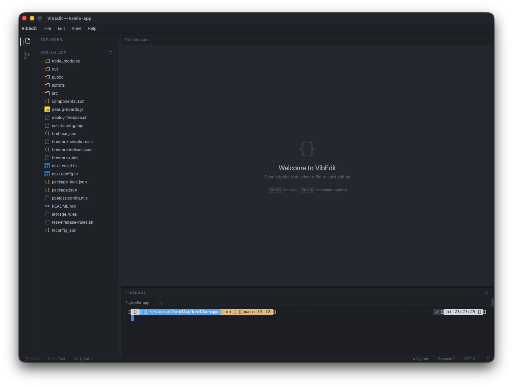
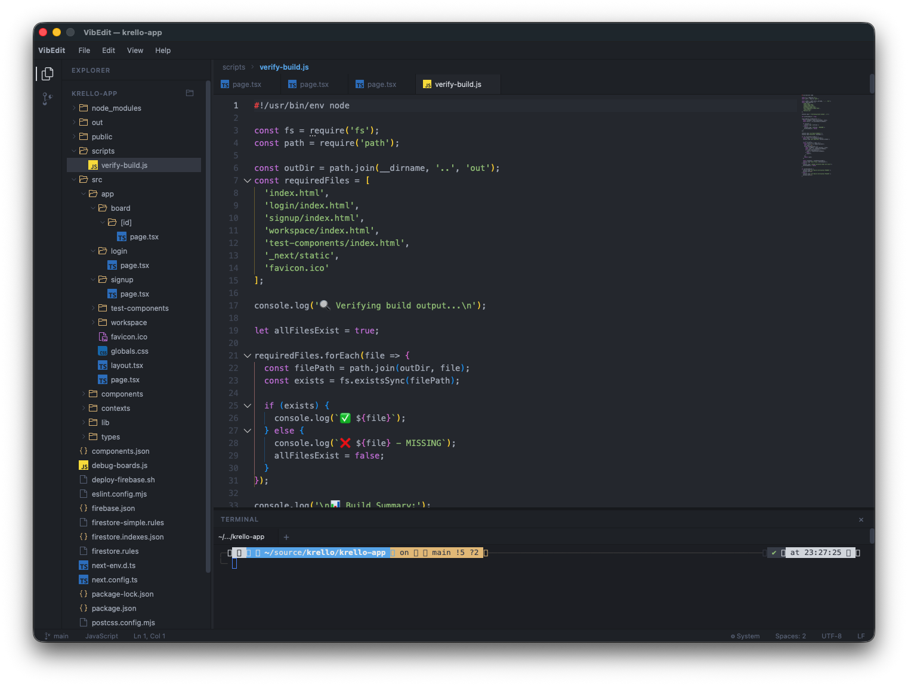
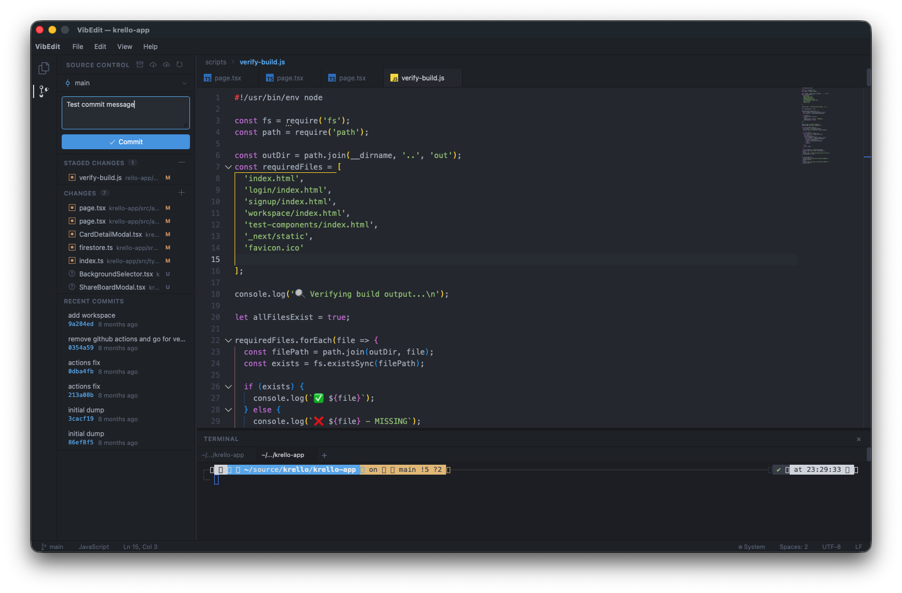
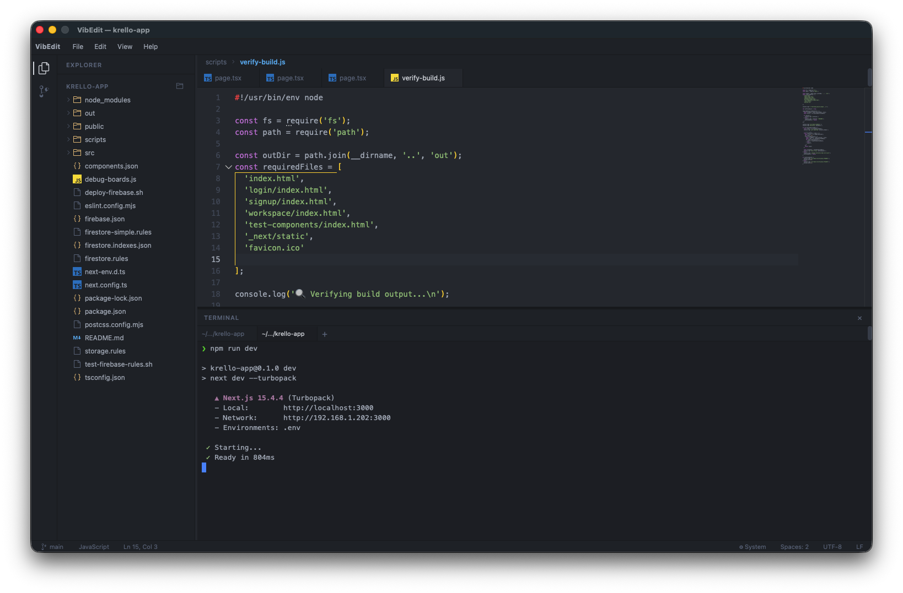
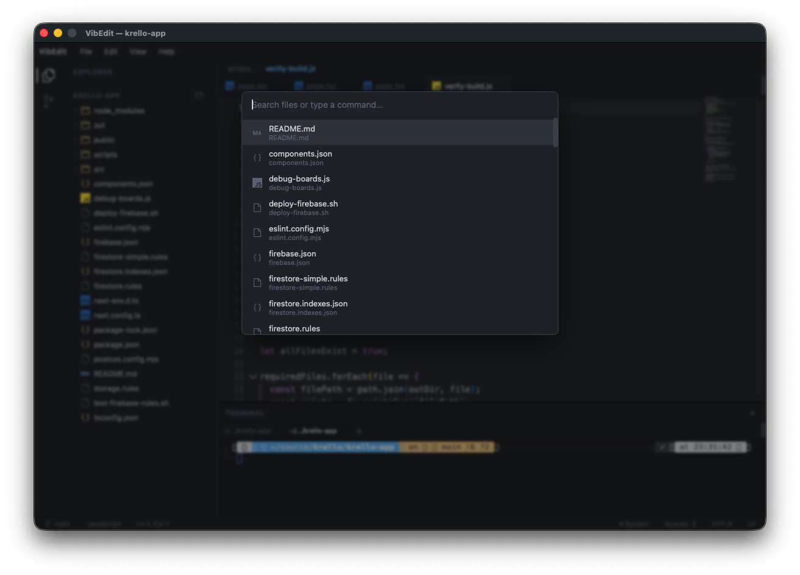

Day 28. Three days left. Yesterday was a terminal emulator. Today? A code editor.

Not a web app. Not something running in a browser tab. A native desktop application you install on your machine. The kind of thing that takes teams years to build.

## The Prompt


Download it from the [latest release](https://github.com/nunocoracao/Vibe30-day28-idea/releases/latest)


> "Build a native desktop code editor using Wails v2 with Go backend and React frontend with Monaco Editor. File tree sidebar, tabs, syntax highlighting. Multi-platform builds for macOS, Linux, and Windows."

## How It Was Built

This one was a beast. [Watchfire](https://watchfire.io) broke the work down into 43 tasks, which is by far the most tasks for any project in this challenge. And a lot of those were CI fixes, because building native desktop apps for three platforms turns out to be... not straightforward.

The stack is Wails v2 for the native wrapper, Go for the backend file system operations, React for the UI, and Monaco Editor (the same editor engine that powers VS Code) for the actual code editing. The Go backend handles all the file I/O, reading directories, opening files, saving changes, and exposes those as functions the React frontend can call through Wails bindings.

The CI pipeline was where the real pain showed up. WebKit dependencies on Linux, build tags that needed to be just right, Wails bindings generation, cross-platform packaging. I lost count of how many "fix CI" commits there were. The git log is full of them. But that's the reality of shipping native apps. The code can work perfectly on your machine and still fail spectacularly in a GitHub Actions runner.



## What I Got



**A proper welcome screen.** Quick actions for opening folders and files, recent projects list, and a keyboard shortcuts reference. It looks like an actual IDE welcome page.



**File tree that works.** Open a folder and you get a full directory tree in the sidebar with expand/collapse, file icons, and the whole deal. There's a minimap at the bottom showing a bird's eye view of the file structure.



**Monaco Editor doing its thing.** Full syntax highlighting, line numbers, the minimap on the right side. It's the same editing experience as VS Code because it literally is the same editor component. JavaScript, Go, TypeScript, JSON, whatever you open gets proper highlighting.



**A command palette.** That fuzzy search overlay that every modern editor has. Search for commands, jump to files. It works.



**An integrated terminal.** There's a terminal panel at the bottom of the editor. Run your builds, check git status, whatever you need without leaving the app.



**File search with fuzzy matching.** Quick open overlay to jump between files in your project. Type a few characters and it filters down.

## The CI War

This deserves its own section because it dominated the build. Getting Wails to compile and package correctly on GitHub Actions for macOS, Linux, and Windows simultaneously was a multi-commit battle. Some highlights:

- WebKit dependencies on Linux needed specific packages (`libgtk-3-dev`, `libwebkit2gtk-4.0-dev`)
- Build tags had to be set correctly for each platform
- Wails bindings generation had to happen before the build
- The release workflow needed to produce `.app` bundles for macOS, tarballs for Linux, and `.exe` for Windows
- Multiple rounds of fixing, testing, fixing again

The final result is a GitHub Actions workflow that builds and releases for all three platforms automatically when you push a tag. It works. It just took a while to get there.

## Install It

This is a native app, so no Vercel link this time. You install it on your machine.

**Quick install (macOS and Linux):**

```bash
curl -fsSL https://raw.githubusercontent.com/nunocoracao/Vibe30-day28-idea/main/install.sh | bash
```

Or grab a binary from the [releases page](https://github.com/nunocoracao/Vibe30-day28-idea/releases/latest):

| Platform | Architecture | Download |
|----------|-------------|----------|
| macOS | Intel (x86_64) | [VibEdit-macos-amd64.zip](https://github.com/nunocoracao/Vibe30-day28-idea/releases/latest/download/VibEdit-macos-amd64.zip) |
| macOS | Apple Silicon (arm64) | [VibEdit-macos-arm64.zip](https://github.com/nunocoracao/Vibe30-day28-idea/releases/latest/download/VibEdit-macos-arm64.zip) |
| Linux | x86_64 | [VibEdit-linux-amd64.tar.gz](https://github.com/nunocoracao/Vibe30-day28-idea/releases/latest/download/VibEdit-linux-amd64.tar.gz) |
| Windows | x86_64 | [VibEdit-windows-amd64.zip](https://github.com/nunocoracao/Vibe30-day28-idea/releases/latest/download/VibEdit-windows-amd64.zip) |

**Build from source** if you want (requires Go 1.23+, Node.js 20+, Wails CLI v2):

```bash
go install github.com/wailsapp/wails/v2/cmd/wails@latest
git clone https://github.com/nunocoracao/Vibe30-day28-idea.git
cd Vibe30-day28-idea
cd frontend && npm install && cd ..
wails build
```

## Try It



## The Numbers

- **43 Watchfire tasks** from setup to final CI fixes
- **3 target platforms** (macOS, Linux, Windows)
- **Wails v2 + Go** backend with React + Monaco Editor frontend
- **GitHub Actions** release workflow for automated multi-platform builds

## Day 28 Verdict

The editor itself came together reasonably fast. Monaco Editor does a lot of the heavy lifting, and Wails makes the bridge between Go and React surprisingly clean. The hard part was everything around the code: getting CI to build native apps for three operating systems, handling platform-specific dependencies, packaging correctly for each target.

Is this going to replace VS Code? Obviously not. But it's a working native code editor with a file tree, tabs, syntax highlighting, a command palette, an integrated terminal, and multi-platform releases. Built in a day. The fact that the same Monaco Editor that powers VS Code is available as a React component means you get a real editing experience for free. The rest is just plumbing, and that's exactly the kind of work AI is good at.

43 tasks is a lot. Most days in this challenge were in the 15-25 range. But native desktop apps with CI pipelines are a different animal. Every platform has its quirks, every build system has its opinions, and none of them agree with each other. Two more to go.

---

*This is day 28 of [30 Days of Vibe Coding](/series/30-days-of-vibe-coding/). Follow along as I ship 30 projects in 30 days using AI-assisted coding.*
