Giorno 29. Dopo questo ne resta solo uno. Quindi ho clonato Notion.

Non tutto. Ma l'esperienza principale: un editor a blocchi con pagine annidate, comandi slash e una sidebar pulita per la navigazione. Il risultato e' n0ti0n. Il frontend si e' messo insieme velocemente. Il deployment e' stata un'altra storia.

## Il Prompt

> "Costruisci un editor a blocchi ispirato a Notion con pagine annidate, comandi slash, formattazione rich text, blocchi di codice con evidenziazione della sintassi, tabelle, liste di attivita' e una sidebar per la navigazione. Usa Tiptap per l'editor, Firebase Firestore per la persistenza in tempo reale, autenticazione anonima cosi' chiunque possa provarlo, e dark mode."


Provalo tu stesso [qui](https://blocknotes-lime.vercel.app)


## Cosa ho ottenuto

L'editor usa Tiptap 3, che e' un fantastico framework per editor a blocchi, e mi ha dato la maggior parte di quello che volevo direttamente con le estensioni giuste. Hai i comandi slash che compaiono quando digiti `/`, permettendo di inserire titoli, liste, blocchi di codice, tabelle, liste di attivita', separatori e persino pagine annidate. Seleziona qualsiasi testo e appare un menu a bolla con opzioni di formattazione inline come grassetto, corsivo, barrato, evidenziato e link.

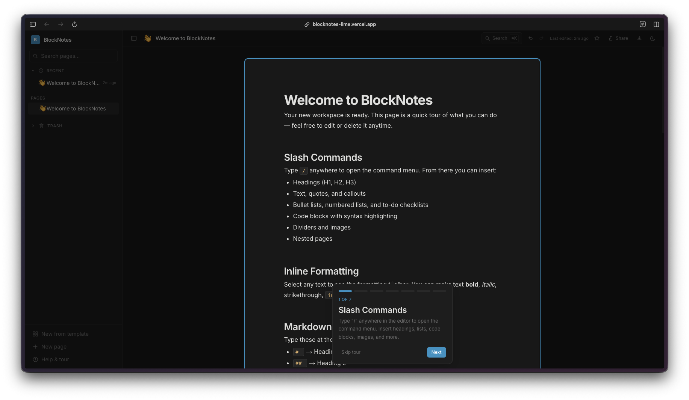

La sidebar e' dove le pagine annidate brillano davvero. Puoi creare pagine dentro altre pagine, e la struttura ad albero appare nel pannello di sinistra con sezioni comprimibili. C'e' una palette di ricerca/comandi (Cmd+K) che permette di saltare rapidamente tra le pagine, attivare la modalita' chiara o creare nuove pagine al volo.

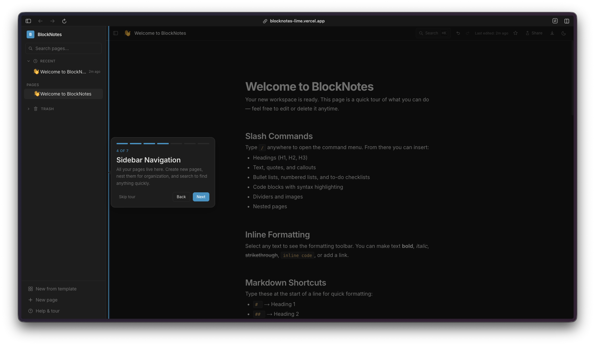

Ci sono anche template integrati. Quando crei una nuova pagina, puoi scegliere tra template pre-costruiti come itinerari di viaggio, note di riunione o piani di progetto. Ogni template viene pre-compilato con una struttura utile.

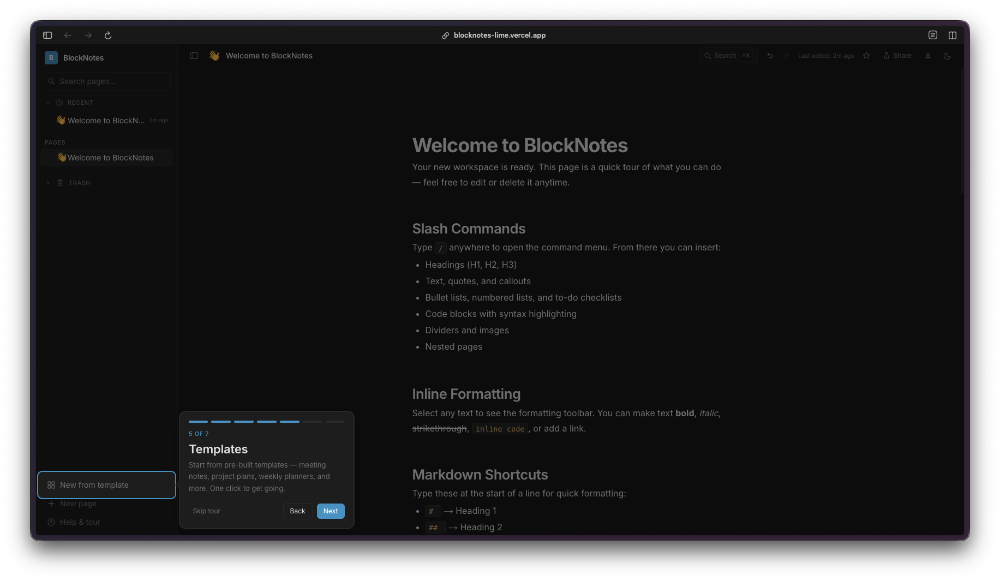

Il menu dei comandi slash e' pulito e funzionale. Digita `/` ovunque nell'editor e ottieni un menu a tendina con tutti i tipi di blocco: titoli, testo, elenchi puntati, elenchi numerati, liste di attivita', blocchi di codice, tabelle, citazioni, separatori, immagini e pagine annidate.

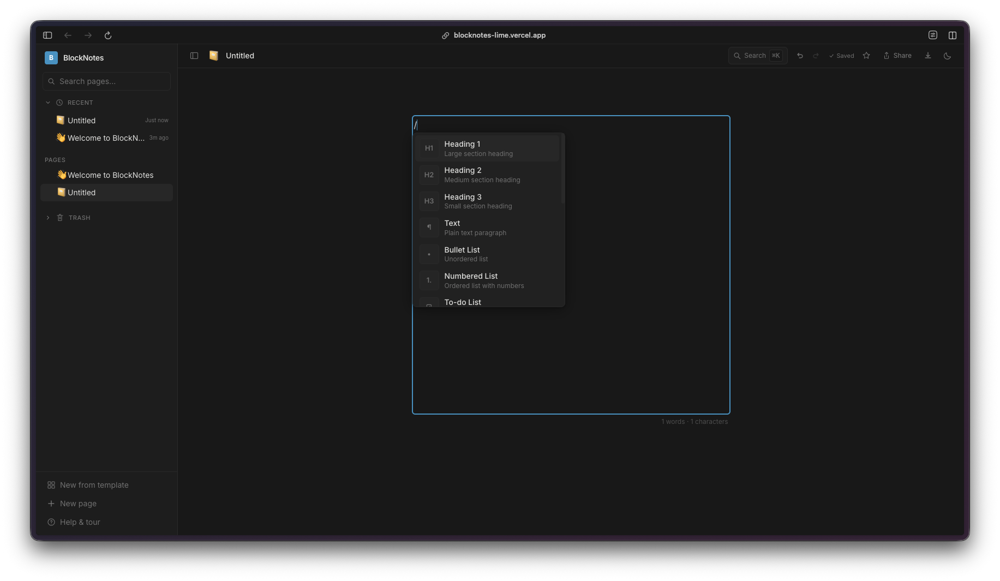

Le pagine possono essere condivise sul web con un toggle, e ci sono opzioni di esportazione per Markdown e JSON. Il tutto e' anche responsive, e funziona bene su mobile.

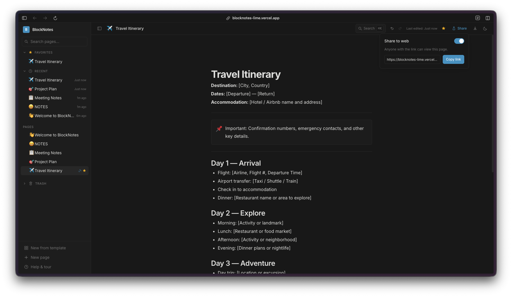

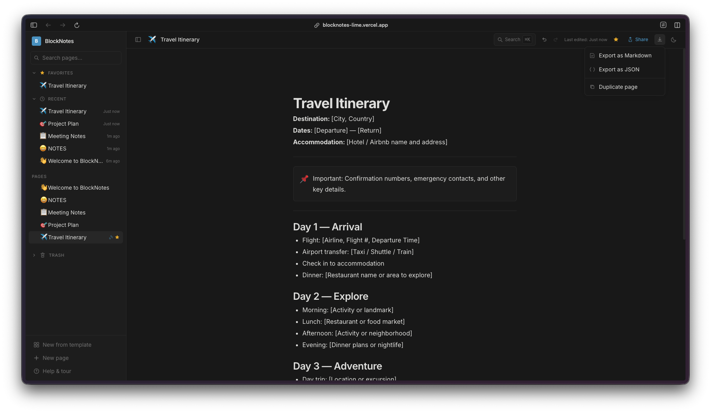

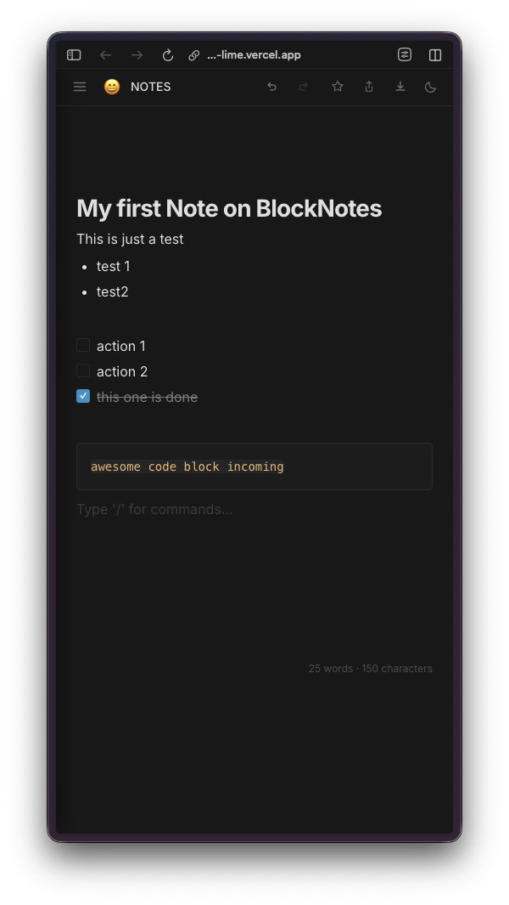

Tutto si sincronizza in tempo reale tramite Firebase Firestore con autenticazione anonima, quindi chiunque puo' aprire l'app e iniziare a scrivere senza creare un account.



## La Saga Firestore

Ecco la cosa di questo progetto che vale davvero la pena raccontare in dettaglio. L'editor in se' si e' messo insieme abbastanza facilmente. Tiptap e' ben documentato, le estensioni sono modulari, e Claude ha gestito l'integrazione senza troppe indicazioni. La vera sfida e' stata far funzionare Firestore correttamente in produzione.

Il git log di questo progetto e' assurdo. Ci sono decine di commit solo per il debug dei problemi di deployment di Firestore. Configurazione del long polling, impostazioni della cache, fallback all'API REST, pulizia delle variabili d'ambiente, gestione dei timeout di connessione... e' stata una sfilata di piccoli problemi dolorosi che si presentavano solo dopo il deployment su Vercel.

In locale tutto funzionava perfettamente. Ma in produzione, le connessioni Firestore si bloccavano, i dati non si caricavano, o l'app falliva silenziosamente nella sincronizzazione. Ogni fix portava alla scoperta del problema successivo. Pulire gli spazi bianchi dalle variabili d'ambiente ha risolto un problema. Passare da WebSocket al long polling ne ha risolto un altro. Regolare la configurazione della cache ne ha risolto un terzo. Era un classico "funziona sulla mia macchina" spalmato su probabilmente 15-20 commit.

Questa e' onestamente una delle parti piu' realistiche dell'intera sfida. Costruire la UI e' la parte divertente. Farla funzionare davvero in produzione con un vero backend e' dove se ne va il tempo. E con il coding assistito dall'IA, il ciclo di debug e' interessante perche' Claude puo' suggerire fix velocemente, ma devi comunque fare il deploy, testare e iterare. Il ciclo di feedback e' piu' lento dello sviluppo locale, non importa quanto sia veloce l'IA.

[Watchfire](https://watchfire.io) ha rilevato i problemi di deployment quasi immediatamente, il che mi ha almeno risparmiato di scoprirli giorni dopo tramite segnalazioni degli utenti.

## Provalo



**[Demo dal vivo](https://blocknotes-lime.vercel.app)**

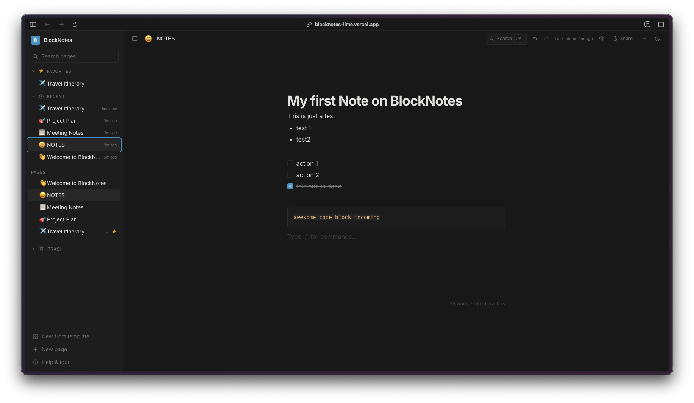

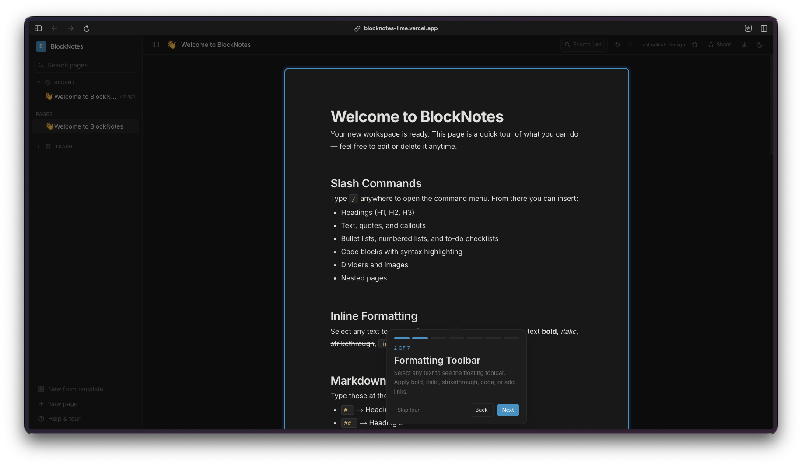

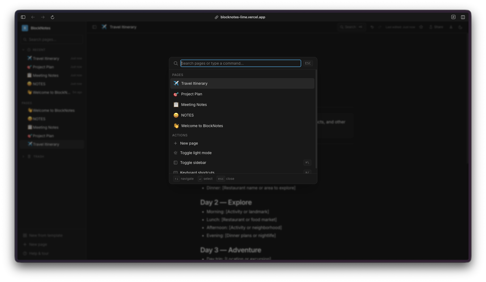

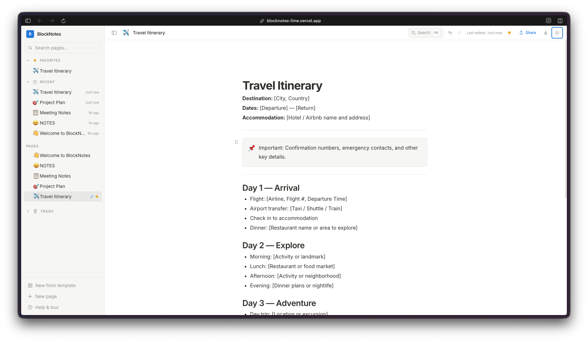

## Verdetto del Giorno 29

Un editor a blocchi con vera persistenza, pagine annidate e un'interfaccia pulita e' qualcosa di cui la gente ha davvero bisogno. Tiptap 3 ha fatto il grosso del lavoro lato editor, e Firebase ha gestito il backend, ma collegare tutto insieme e soprattutto far si' che il deployment si comportasse bene ha richiesto un vero sforzo. La saga del debug di Firestore e' un buon promemoria che la parte difficile dello shipping del software raramente e' il codice delle funzionalita'. E' l'infrastruttura, i casi limite e le cose che si rompono solo in produzione. Ancora un giorno.

---

*Questo e' il giorno 29 di [30 Days of Vibe Coding](/series/30-days-of-vibe-coding/). Segui l'avventura mentre pubblico 30 progetti in 30 giorni usando il coding assistito dall'IA.*
