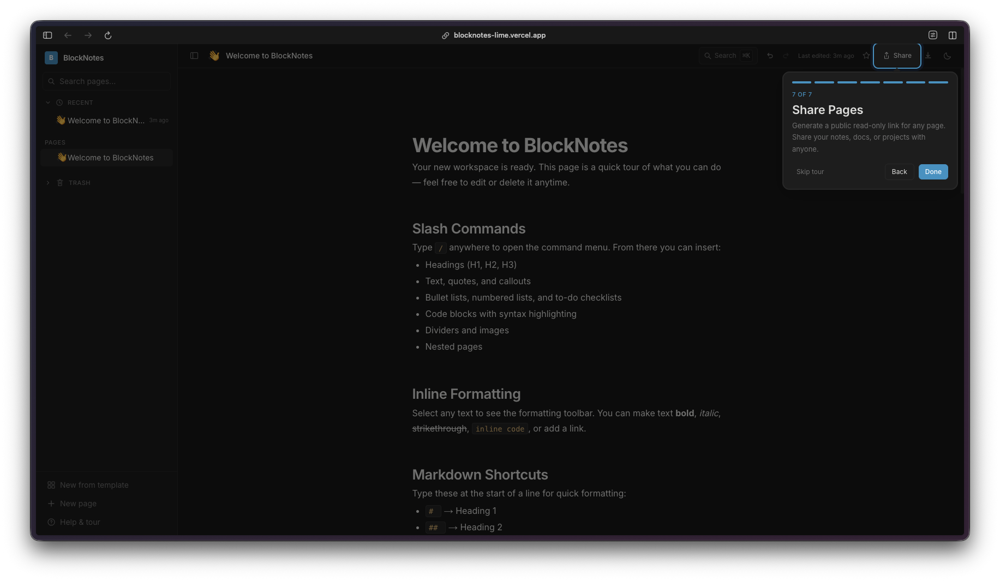

Day 29. With one day left after this, I decided to go after something I use every single day: Notion. Not all of it, obviously. But the core experience of a block editor with nested pages, slash commands, and a clean sidebar for navigation. The result is n0ti0n, a surprisingly capable writing tool that came together faster than I expected... once I got past the deployment nightmare.

## The Prompt

> "Build a Notion-inspired block editor with nested pages, slash commands, rich text formatting, code blocks with syntax highlighting, tables, task lists, and a sidebar for navigation. Use Tiptap for the editor, Firebase Firestore for real-time persistence, anonymous auth so anyone can try it, and dark mode."

## What I Got

This one turned out really well. The editor uses Tiptap 3, which is a fantastic block-based editor framework, and it gave me most of what I wanted out of the box with the right extensions. You get slash commands that pop up when you type `/`, letting you insert headings, lists, code blocks, tables, task lists, dividers, and even nested pages. Select any text and a bubble menu appears with inline formatting options like bold, italic, strikethrough, highlight, and links.

The sidebar is where the nested pages really shine. You can create pages inside pages, and the tree structure shows up in the left panel with collapsible sections. There is a search/command palette (Cmd+K) that lets you jump between pages quickly, toggle light mode, or create new pages on the fly.

There are also templates built in. When you create a new page, you can pick from pre-built templates like travel itineraries, meeting notes, or project plans. Each template comes pre-filled with a useful structure.

The slash command menu itself is clean and functional. Type `/` anywhere in the editor and you get a dropdown with all the block types: headings, text, bullet lists, numbered lists, to-do lists, code blocks, tables, blockquotes, dividers, images, and nested pages.

Pages can be shared to the web with a toggle, and there are export options for Markdown and JSON. The whole thing is responsive too, working nicely on mobile.

Everything syncs in real-time through Firebase Firestore with anonymous auth, so anyone can open the app and start writing without creating an account.



## The Firestore Saga

Here is the thing about this project that is actually worth talking about in detail. The editor itself came together relatively smoothly. Tiptap is well-documented, the extensions are modular, and Claude handled the integration without much hand-holding. The real challenge was getting Firestore to work properly in production.

The git log for this project is wild. There are dozens of commits just debugging Firestore deployment issues. Long polling configuration, cache settings, REST API fallbacks, environment variable trimming, connection timeout handling... it was a parade of small, painful problems that only showed up after deploying to Vercel.

Locally everything worked perfectly. But in production, Firestore connections would hang, data would not load, or the app would silently fail to sync. Each fix led to discovering the next issue. Trimming whitespace from environment variables fixed one problem. Switching from WebSocket to long polling fixed another. Adjusting the cache configuration fixed a third. It was a classic "works on my machine" situation stretched across probably 15-20 commits.

This is honestly one of the more realistic parts of the whole challenge. Building the UI is the fun part. Making it actually work in production with a real backend is where the time goes. And with AI-assisted coding, the debugging loop is interesting because Claude can suggest fixes quickly, but you still need to deploy, test, and iterate. The feedback cycle is slower than local development no matter how fast the AI is.

[Watchfire](https://watchfire.ai) picked up the deployment issues almost immediately, which at least saved me from discovering them days later through user reports.

## Try It

{{/*< github repo="nunocoracao/Vibe30-day29-n0ti0n" >*/}}

**[Live Demo](https://vibe30-day29-n0ti0n.vercel.app)**

## Screenshots

## Day 29 Verdict

A block editor with real persistence, nested pages, and a clean UI is something people actually need. Tiptap 3 did a lot of the heavy lifting on the editor side, and Firebase handled the backend, but wiring it all together and especially getting the deployment to behave took real effort. The Firestore debugging saga is a good reminder that the hard part of shipping software is rarely the feature code. It is the infrastructure, the edge cases, and the things that only break in production. One more day to go.

---

*This is day 29 of [30 Days of Vibe Coding](/series/30-days-of-vibe-coding/). Follow along as I ship 30 projects in 30 days using AI-assisted coding.*
