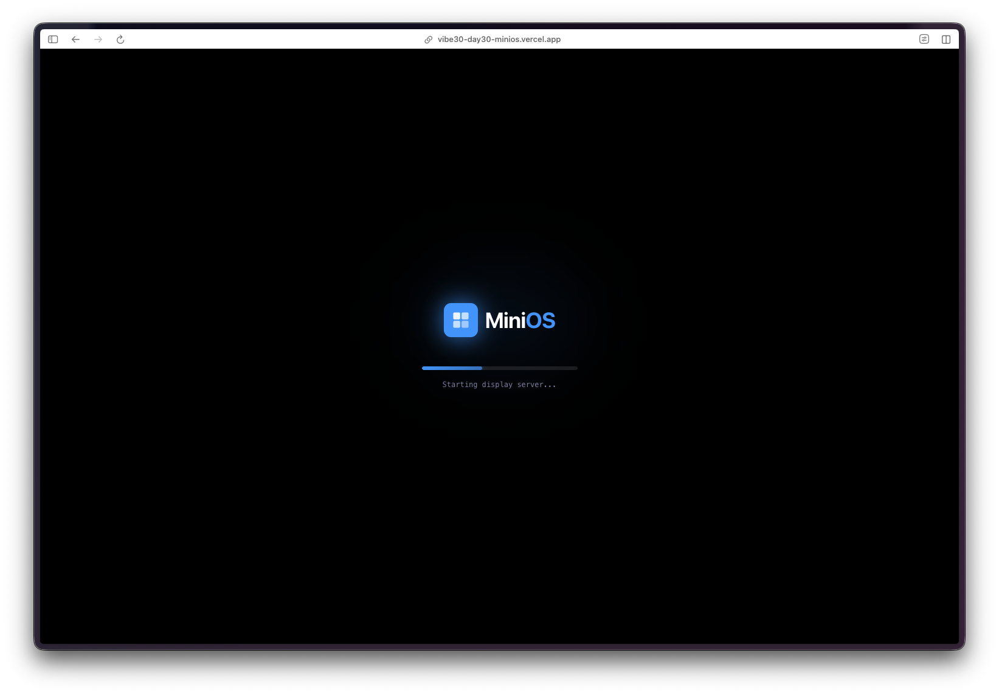
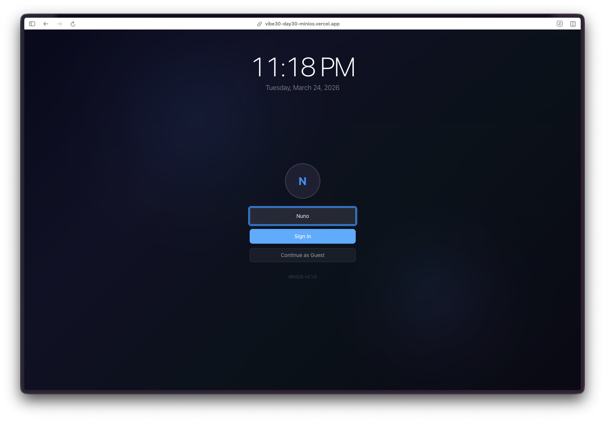
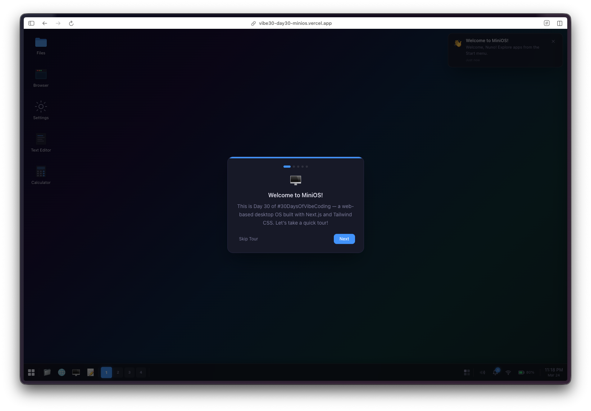
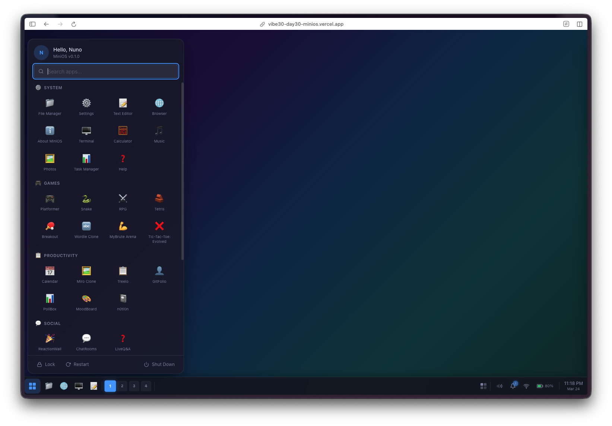
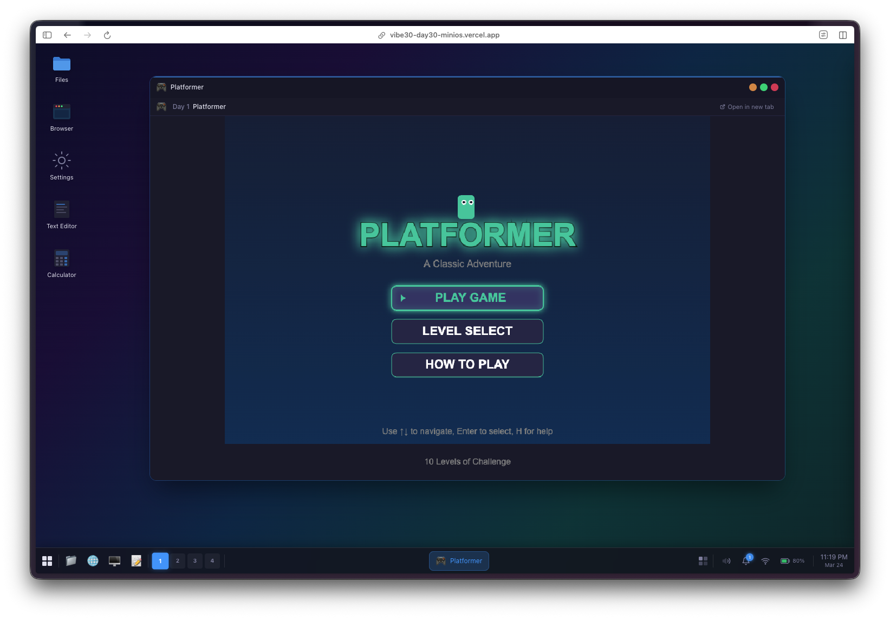
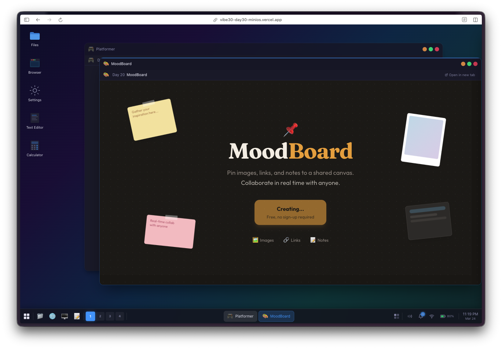
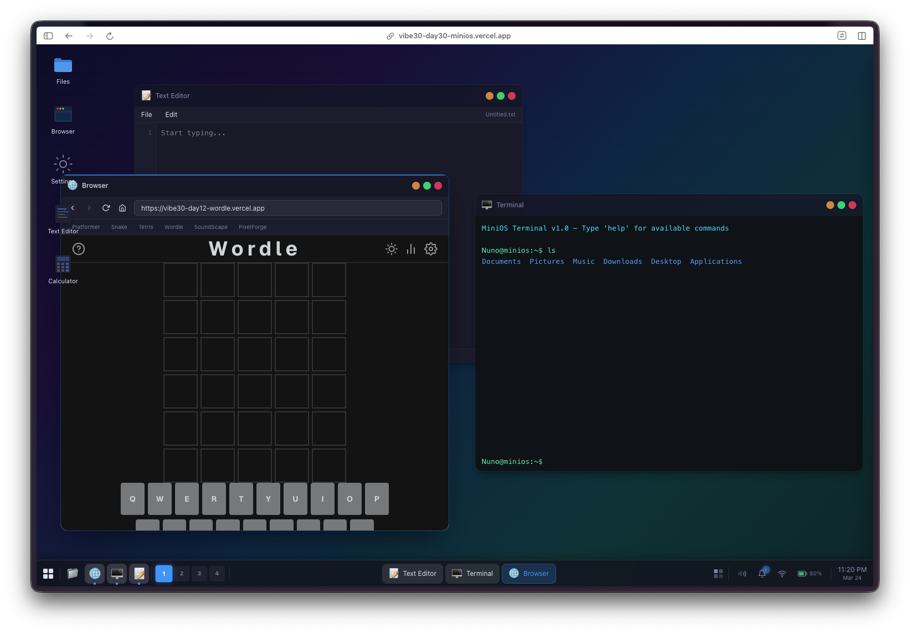

Day 30. The last one. I built an operating system.

Not a real one. A fake one in the browser. But the kind of fake where you boot it up, log in, open a file manager, resize some windows, snap them to corners, switch workspaces, open a terminal that runs neofetch, change the wallpaper, and then launch any of the 29 projects I already built this month as apps inside it. That kind of fake.

This is the capstone. Every project from the last 30 days lives inside this one.

## The Prompt

> "Build a web-based desktop OS. Window management with drag, resize, minimize, maximize, snap. Multiple workspaces. Taskbar, start menu, spotlight search, alt-tab. Boot sequence, login screen, lock screen, screensaver. Dark and light themes with accent colors. Wallpapers with parallax. Desktop widgets. Built-in apps: File Manager, Text Editor, Terminal with neofetch, Browser, Calculator, Settings, Music Player, Image Viewer, Paint, Calendar. And every single Vibe30 project should be accessible as an installed app."

The biggest prompt of the challenge, for the biggest project.

## How It Was Built

[Watchfire](https://watchfire.io) broke this one down into 25 tasks. Twenty-five. That's more than any other project in the series, and it makes sense. This wasn't one app. It was a shell that had to contain all the other apps.

The tasks covered everything you'd expect from an OS build (if you can call it that): core window management, the workspace system, taskbar and system tray, start menu, spotlight search, the alt-tab switcher, boot and login flows, the lock screen and screensaver, theming engine, wallpaper system with parallax, desktop widgets, and then each built-in app as its own task. The final tasks handled integrating all 30 Vibe30 projects as launchable apps and building a welcome tour.

I spent the most hands-on time with this one out of all 30 days. Not writing code, but testing interactions. Window snapping has a lot of edge cases. What happens when you drag to a corner? What about maximizing a snapped window? What if you switch workspaces while a window is being dragged? Those are the kinds of things I had to try and report back on.



## What I Got

It boots. There's a boot sequence animation with a loading bar and system messages scrolling by. Then a login screen. Then the desktop loads.

**The window management actually works.** Drag windows around. Grab any edge or corner to resize. Double-click the title bar to maximize. Drag to the left edge to snap left, right edge to snap right, corners to snap to quadrants. Minimize to the taskbar and click to restore. This is the kind of thing that sounds simple but has a million little interaction details.

**Four workspaces.** Switch between them with Ctrl+1 through Ctrl+4, or click in the taskbar. Each workspace has its own set of windows. It feels like a real multi-desktop setup.

**The taskbar is legit.** Start menu button, pinned apps, open window indicators, workspace switcher, system tray with clock. Click the start menu and you get a categorized app launcher. Hit Cmd+K for spotlight search and type to find any app instantly. Alt+Tab brings up a window switcher with previews.

**Dark and light themes with 9 accent colors.** Open Settings, pick your theme, pick your accent color, and the entire OS redraws. There are 4 wallpapers with a parallax effect that responds to mouse movement.

**The built-in apps are surprisingly functional.** The File Manager browses a virtual filesystem. The Text Editor does undo/redo and can save/open files. The Terminal runs commands and has a working neofetch that shows system info for miniOs. The Calculator handles keyboard input. Paint lets you draw. The Calendar works.

**And then there are the Vibe30 apps.** All 30 projects show up in the start menu under their own category. Web projects open in an embedded iframe right inside a miniOs window. TUI and native projects that can't run in a browser show a project card with links to the repo and live demo. You can have the Platformer running in one window, Snake in another, and Wordle in a third, all while the Music Player runs in the background.

That last part is what makes this a capstone. It's not just an OS clone. It's a container for the entire challenge.

## The Bug Reports

This one had the longest bug list of any project:

- Window resize handles were too small on the bottom edge
- Snapping to corners didn't work when a window was already maximized
- The screensaver didn't trigger if a window had focus
- Alt-tab order was wrong after minimizing a window
- Spotlight search results didn't update when switching workspaces
- Some Vibe30 iframes didn't load due to X-Frame-Options headers
- Boot sequence was too fast (ironic bug report, but it needed to feel real)
- Parallax effect was janky on Safari

Window management edge cases were the main theme. Every time I thought snapping worked, I'd find another combination that broke it.

## The Numbers

- **25 Watchfire tasks** from architecture to welcome tour
- **30 Vibe30 projects** integrated as launchable apps
- **10 built-in apps** (File Manager, Text Editor, Terminal, Browser, Calculator, Settings, Music Player, Image Viewer, Paint, Calendar)
- **4 workspaces**, **9 accent colors**, **4 wallpapers**, **2 themes**
- **Next.js 16, React 19, TypeScript, Tailwind CSS 4**

## Try It

{{/*< github repo="nunocoracao/Vibe30-day30-minios" >*/}}

**[Open miniOs](https://vibe30-day30-minios.vercel.app)**

Best experienced on desktop. Try the keyboard shortcuts: Cmd+K for spotlight, Ctrl+1-4 for workspaces, Alt+Tab to switch windows.

## Day 30 Verdict

I keep coming back to the absurdity of this. I asked an AI to build me an operating system and it did. Not a toy demo with a fake taskbar and nothing behind it. A thing with real window management, real workspace isolation, real keyboard navigation, real theming, and 40 working applications inside it.

Is it a real OS? Obviously not. But it's a real piece of software. The window snapping alone is something I'd struggle to implement correctly on my own. The fact that all 30 projects from this challenge can run inside it, simultaneously, in their own windows, on separate workspaces... that's genuinely cool.

Day 1, I built a platformer from one sentence. Day 30, I built an operating system that contains the platformer, and everything I made in between. The scope of what's possible in a single day has been the recurring theme of this whole challenge, and this is the most extreme example of it.

Thirty projects. Thirty days. Done.

---

*This is day 30 of [30 Days of Vibe Coding](/series/30-days-of-vibe-coding/). This was the last project, but there's one more post coming: the full wrapup with everything I learned from shipping 30 projects in 30 days.*
