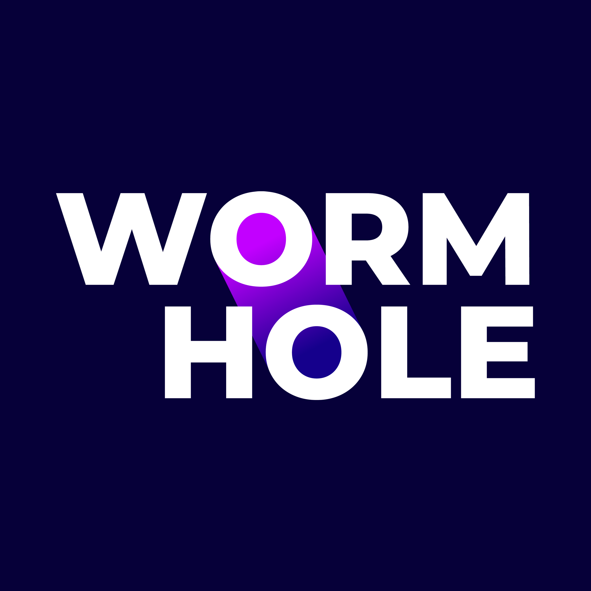

I always try to find time to work and learn something new. Usually, most of these _pet-projects_ don't see the light of day. They are, however, great opportunities to try something in the real world and learn from it.

<table>
    <thead>
        <tr>
            <th>Logo</th>
            <th>Title</th>
            <th>Description</th>
            <th>Link</th>
        </tr>
    </thead>
    <tbody>
         <tr>
            <td></td>
            <td>Blowfish</td>
            <td>A powerful, lightweight theme for Hugo built with Tailwind CSS.</td>
            <td><a target="_blank" href="https://blowfish.page">site</a> <a target="_blank" href="https://github.com/nunocoracao/blowfish">github</a></td>
        </tr>
        <tr>
            <td></td>
            <td>Workmhole</td>
            <td>A wormhole into the universe - Web application privding a feed of space photography</td>
            <td><a target="_blank" href="https://wormhole.photos">site</a> <a target="_blank" href="https://github.com/wormhole-photos">github</a></td>
        </tr>
    </tbody>
</table>